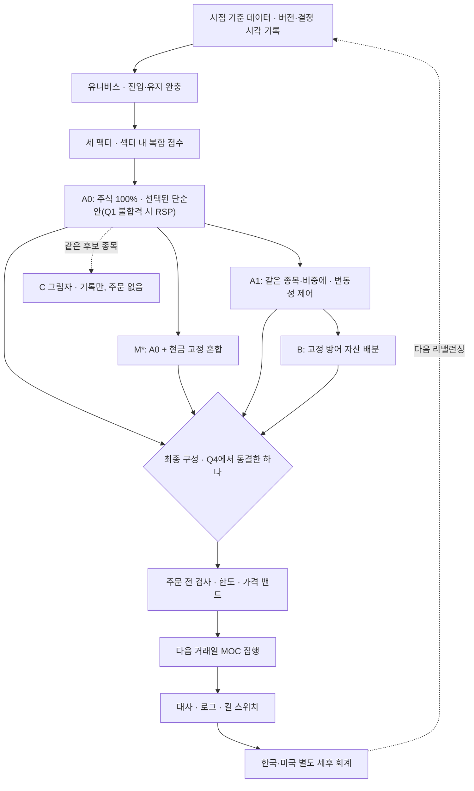
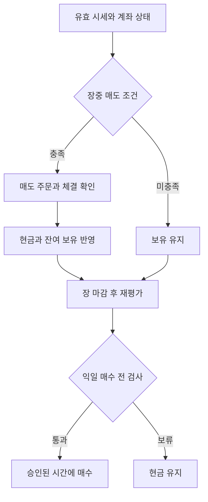

# 1세대 프로그램 매매 모델 계획 v4.3 수정 — 일차 최종본

원본: Sep 24, 2026 · @aidan

일차 최종 정리: 2026-09-25 · 사용자 자본·손실 감내 조건 반영

## 0. 일차 최종 확정 요약

이 문서는 v4.3 연구 계획에 이후 사용자 결정을 반영한 **계획 단계의 일차 최종본**입니다. 실거래 승인본이나 모든 매개변수가 동결된 실행 명세는 아닙니다. 기존 연구 정의와 변경 이력은 보존하며, 현재 확정 상태는 이 장과 15장을 기준으로 읽습니다.

| 항목 | 이번 기준 | 상태 |
| --- | --- | --- |
| 초기 운용자본 | **$20,000** | 사용자 입력 확정. 연구 초기자본으로 사용; 전액 즉시 실거래 투입을 뜻하지 않음 |
| 기준 통화 | **달러** | 성과·계좌 위험의 기준. 환율은 세금 계산과 달러 비용·부채 환산에 사용 |
| 최대 손실 감내 경계 | **계좌 고점 대비 낙폭 30%** | 사용자 입력 확정. 자동 손절선·손실 보장 상한이 아님 |
| 부담을 느끼는 수준 | **고점 대비 낙폭 약 25%** | 앞선 발언을 반영한 정성적 참고. 자동 경보·매도 규칙으로 확정한 것은 아님 |
| 매수 시 종목 상한 | 계좌 순자산의 5% | 기존 원칙 유지. 보유 중 상한·초과 조정은 미정 |
| 운용 흐름 | 장중 조건부 매도 → 장 마감 후 재평가 → 익일 조건부 매수 | 기존 사용자 선택 유지 |
| 무료 연구 출발안 | QuantConnect 무료 클라우드, 신규 유료 데이터·서버 구독 $0 | 권고 잠정안. 실시간 모의운용·실거래 월 예산은 미정 |
| 브로커 | IBKR 우선 확인 | 후보. 본인 계좌 승인·API·시세·수수료 확인 전 확정 아님 |
| 손절·재진입·체결 시각 | 15.3절의 소수 후보로 연구 | 제안이며 사용자 채택·성과 검증 전 |

**30%의 의미.** 계좌 최고액이 $20,000이면 $14,000이 −30%이고 손실은 $6,000입니다. 최고액이 $24,000이면 $16,800이 −30%입니다. 초기 입금액에서 고정 $6,000을 잃을 때마다 적용하는 규칙이 아닙니다. 실제 입출금은 14.9절에 따라 보정합니다.

**감내 경계와 판정·대응 규칙을 구분합니다.** 30%는 위험 설계를 위한 사용자 입력입니다. Q4·E의 역사적 낙폭 및 스트레스 합격선, 운영 경보·매수 중단·노출 축소 기준은 여유폭을 포함해 Stage 0에서 별도 확정합니다. 30%를 그대로 백테스트 합격선이나 자동 전량 매도선으로 복사하지 않습니다. 한도 판정에 쓸 세전·세후 자산 기준과 세금 부채 갱신 방식도 아직 미정입니다.

## 1. 결론

**이번 개정의 적용 범위.** 사용자가 선택한 운용 방향은 **장중 매도 조건 감시 → 조건 충족 시 매도 → 장 마감 후 시장·종목 재평가 → 다음 거래일 조건부 매수**입니다. 적격 후보가 없으면 현금을 유지하고, 기존 종목 추가 매수는 억제합니다. 이 문서에서는 이를 **운용안 E**라고 부릅니다. 손절률·기준 가격·매수 체결 시각은 아직 확정하지 않았습니다.

기존 4·6·7·10장의 월별 A0·A1·B·M\*·C는 **연구 기준선**으로 보존합니다. E는 현금 보유와 매매 시점이 달라지는 별도 전략이며, 기존 결과만으로 실거래를 승인하지 않습니다. 실운용에는 14장의 규약과 별도 검증이 필요합니다. 변경 이력에 인용된 과거 결정은 현재 운용 지시가 아닙니다.

1세대 연구 대상은 세 단계입니다. **A0**는 주식 100%로 종목 선정을, **A1**은 A0에 변동성 제어를, **B**는 A1에 고정 방어 자산 배분을 더한 것입니다. 단계마다 알맞은 기준선과 비교해 성과가 어디서 왔는지 나눠 보고합니다. 2022년 이후 자료는 설계 시점에 이미 알려진 **역사적 의사 OOS**이고, 규약을 동결한 뒤 새로 쌓이는 기간만 전향 OOS로 부릅니다.

| 결정 | 1세대 규칙 |
| --- | --- |
| 종목 선정 | 모멘텀·퀄리티·가치 동일가중. 섹터 내 순위 점수가 기본이고 전역 점수는 비교 실험 |
| 구성 | 동일가중·역변동성 Top-N 중 개발 구간에서 고른 단순안이 1세대 A0(Q1 불합격이면 RSP). 최적화(C)는 연구 후보로, Q1b를 통과해도 1세대에서는 그림자 포트폴리오로만 기록(10장) |
| 성과 분해 | A0 → A1 → B의 추가 효과를 따로 보고 |
| 기준선 | A0는 무작위 점수 Top-N 대조군(신호의 부가가치)과 RSP(거래 가능한 투자 대안)를 모두 넘어야 함. A1·B는 위험 조건을 통과해야 후보가 됨. 최종 구성은 달러 기준 계좌 낙폭 한도를 지키는 후보 중 가장 단순한 것에서 시작해, 달러 로그 성장률 우위가 통계적으로 뚜렷할 때만 더 복잡한 후보로 넘어가는 잠정 선택. 한도를 지키는 후보가 없으면 자동 집행을 보류하고 주식 비중을 낮춘 구성을 다시 검증(10장) |
| 판정 | 질문별 주 지표·최소 효과 크기·구간 조건을 결과를 보기 전에 숫자로 고정(10장) |
| 기대수익 단위 | C안은 단순안이 보유한 N개 이하 종목을 후보로, 그 안에서 비중과 보유 여부를 최적화. α = â·σ̂·z(â는 무차원, â > 0이어야 시험). 위험은 연율 최소 추적오차에 1%p 또는 3%p를 더한 예산 제약, 비용 계수 κ = 1(4·6장) |
| 실행 | 운용안 E: 장중 조건부 매도, 매일 장 마감 후 재평가, 다음 거래일 조건부 매수. 매수는 익일 MOC를 제안하되 Stage 0에서 확정(14장). 월별 집행은 연구 기준선 |
| 위험·세금 | 무차입 변동성 타기팅. 성과·위험·손실 한도는 모두 달러 기준이고 원화 환산은 한국 세금 계산에만 씀. 최적화는 세전, 세후는 과세 지위를 확정한 뒤 한국·미국 별도 회계 |
| 데이터·운영 | 시점 기준 데이터, 버전·결정 시각 기록, 주문 전 검사와 잔고 대사 |

**규약 동결 원칙.** 결과를 본 뒤 규칙을 고치면 그 구간을 다시 독립 테스트로 쓰지 않습니다. 모든 시도와 기각 결과를 기록하고, 바뀐 전략은 이후 전향 관측이나 새로 확보한 미사용 자료로 따로 평가합니다. 0장에 사용자 확정값으로 표시한 $20,000·30% 및 기존 확정 원칙 외의 연구 숫자는 Stage 0에서 확정할 제안값입니다.

이 계획은 미국 주식 시스템 트레이딩 참고 자료집의 자료를 바탕으로 여러 차례 교차 검토를 거친 연구·개발 계획이며, 투자 권유가 아닙니다.

## 2. 변경 이력

**2026-10-01 개정(사용자 결정, 결과 보기 전):** 5단계에서 Q1 ④(개발 구간 DSR 0.181, PBO 0.706)가 미달해 Q1 불합격으로 기록하고 A0 자리에 ETF를 넣는다. 대체 경로의 주식 부분 후보를 **RSP와 SPY 둘**로 넓히고, 각각에 M\*·A1·B를 같은 규칙으로 적용한다. Q4는 주식 ETF별로 따로 적용해 각자의 최종 후보를 고른 뒤, 두 최종 후보가 모두 한도를 지키면 2005년~동결 직전 달러 로그 성장률 차이의 90% 신뢰구간(Newey–West)이 0보다 큰 쪽을, 아니면 SPY(보수·스프레드가 낮고 유동성이 큼)를 고른다. Stage 0 값은 제안값으로 확정: 계좌 낙폭 한도 30%(세전·일별·달러), σ\_target 연 10%, B = A1 70%·IEF 15%·GLD 15%, 현금 = SGOV(설정 전 1개월 T-bill − 연 0.09%).

**v4.3 → 일차 최종본:** 초기 운용자본 $20,000과 최대 감내 낙폭 30%를 반영했습니다. 25%는 부담 수준으로 구분하고, 무료 백테스트 경로·IBKR 후보·미채택 매매 후보와 남은 Stage 0 결정을 15장에 정리했습니다. 7장의 환율 문장은 14.8절과 통일했습니다. 아래는 이전 버전의 이력이며 과거 미정 표시나 과거 결정은 현재 규약을 대체하지 않습니다.


v4.3은 v4.2 재검토에서 나온 계산 정의 세 가지(기말 세금 부채의 환율, 최종자산 CAGR과 시간가중 수익률의 적용 범위, E 자체의 위험 한도 통과)를 보완한 수정입니다. 계획서 수정은 여기서 멈추고 Stage 0 입력값(자본 규모, 계좌 낙폭 한도, 보유 상한, 브로커, 데이터 조건, 세무 조건)을 정하는 단계로 넘어갑니다. 이전 변경은 아래 표들에 남겨 두었습니다.

**v4.2 → v4.3**

| 항목 | 문제 | v4.3 |
| --- | --- | --- |
| 기말 세금 부채 환율 | 종료일에는 미래 납부일 환율을 알 수 없음 | 성과평가에서 실제 납부 세금은 실제 달러 지출·환전 비용, 종료일 미납 부채는 종료일 환율로 평가, 종료 후 납부 차이는 별도 반영. 세무 신고 원장의 환산 규칙과는 분리(14.8) |
| 최종자산 CAGR과 시간가중 수익률 | 입출금이 있으면 두 계산이 다름 | 연구 비교는 같은 초기자본·외부 입출금 없음으로 하고 기말 청산 후 세후 최종자산 CAGR로 판정. 실제 운용은 외부 입출금을 조정한 세후 시간가중 수익률의 연율로 보고(14.8·14.9) |
| E 자체의 위험 한도 | 비교 대상의 한도 통과만 명시 | E가 먼저 일말 달러 MDD·스트레스 손실 기준을 통과해야 세후 CAGR 비교로 넘어감. 낙폭은 세금 부채를 뺀 세후 순자산 경로로도 기록(14.8) |
| C의 회전율 판정 | 월평균 기준은 월별 하드 제한과 다름 | 정상 최적화의 월별 예상 회전율 제약, 대체 거래 포함 전체 전략의 실현 월평균 판정, 최대 월 회전율·예외 달 비율·예외 거래 비용 보고를 구분. 전체 전략을 월별 하드 제한 전략이라 부르지 않음(10장) |

**v4.1 → v4.2**

| 항목 | 문제 | v4.2 |
| --- | --- | --- |
| 세금 인출 | 세금 납부를 일반 출금으로 보정하면 세후 성과에서 세금이 사라짐 | 투자자의 납입·생활비 인출만 외부 현금흐름으로 보정. 세금·수수료는 비용으로 반영. 세금을 발생 시점에 부채로 잡으면 납부 때 다시 차감하지 않음(14.8·14.9) |
| 세후 주 판정 | 기말 보유와 청산 두 결과의 우열이 다를 때 판정 기준이 없음. '세금 미납' 표현 부정확 | 주 판정은 같은 종료일 전량 청산 가정의 세후 CAGR 차이. 계속 보유 시 세후 자산과 미실현이익·잠재 세금은 보조 보고. 종료일 뒤 납부할 실현이익 세금도 포함(14.8) |
| 세무 시나리오 | '다른 소득 없음'만으로는 부족. 대학생은 미국 kiddie tax 대상일 수 있음 | 나이·전일제 학생 여부, 근로소득과 부양비, 부모 세무 지위와 Form 8615, 신고 상태·공제를 시나리오에 추가(14.8·14.9) |
| 현금 비중 비교 | 평가 기간 평균 현금 비중은 사전에 알 수 없는 값 | 판정용은 개발 구간에서 정해 고정한 비중, 평가 기간 평균으로 맞춘 비교는 사후 진단으로만. '원인 구분'을 '노출 축소 효과 추가 점검'으로 고침(14.8) |
| C의 회전율 조건 | 6장의 대체 허용과 Q1b ④ '회전율 예산 안'이 충돌 | 대체 규칙을 포함한 전략으로 평가. ④는 대체 거래를 포함한 실현 평균 회전율 ≤ τ, 예외 달은 제외하지 않음(10장) |
| 직전 비중 시점 | 익일 종가 비중을 월말 최적화에 넣으면 미래정보 | 최적화는 결정 시점 관측 비중, 주문 제출 시 최신 잔고로 수량·한도 검사, 실현 회전율·비용은 체결 결과로 따로 계산(4장) |
| 보유 상한 | 보유 상한을 5%보다 높게 둔다고 사실상 결정 | 매수 상한 5%만 확정. 보유 상한을 따로 둘지 5%로 둘지는 Stage 0(4·14.4) |

**v4.0 → v4.1**

| 항목 | 문제 | v4.1 |
| --- | --- | --- |
| 당일 매도와 전날 승인 매수 | 전날 승인한 매수가 금지한 '당일 대체 매수'인지 불명확 | 전날 확보한 현금·예산으로 승인한 매수는 당일 안전 검사 통과 시 집행. 당일 매도로 생긴 현금은 그날 예산에 넣지 않음. 계좌 매수 중단 시 전날 주문도 취소 대상, 취소 완료 전엔 살아 있는 주문으로 처리(14.2) |
| 비용 모형 | 결정 비용과 체결 재현 비용을 모두 직전 21일 평균으로 계산해 급락 시 E에 유리 | 결정은 당시 추정치, 체결 재현은 주문 도착 시점의 호가·체결·지연·충격. 자료가 없으면 급락·갭 비용 확대 시나리오. 체결가에 포함된 스프레드를 다시 빼지 않음(9장) |
| 세후 지표 | 지표·세무 시나리오·기말 미실현 이익·납부 재원·세법이 미정 | 고정 세무 시나리오의 세후 CAGR 차이. 기말 계속 보유와 전량 청산을 모두 보고, 외국납부세액공제는 한도 안에서만(14.8) |
| E의 비교 대상 | '월별 기준선'이 A0인지 Q4 구성인지 불명확 | 같은 달러 낙폭 한도를 지키는 Q4 선택 구성. 단계별 분해와 현금 비중을 맞춘 월별 혼합 비교 추가(14.8) |
| 비중 드리프트 | 추가 매수 억제와 동일가중 유지가 양립하지 않음 | 드리프트를 허용하고 보유 상한 초과분만 축소. 5%는 매수 시점 상한, 보유 상한은 Stage 0. 백테스트도 드리프트된 비중 그대로(14.4) |
| 현금의 해 존재 | SGOV도 시장가격·스프레드가 있어 '항상 해가 있다'는 과장 | 계산으로 한도 충족을 확인하고, 적격 구성이 없으면 집행 보류(10장) |
| C 대체 | 단순안으로 대체하면 회전율 예산을 넘을 수 있음 | 최적화 실패·예외로 기록하고 실제 비용·회전율 반영. 이전 비중은 가격이 반영된 주문 직전 비중(4·6장). w\*는 사전 규칙으로 데이터에서 정해진 값이라고 명시(10장) |
| 구현 전 정의 | 낙폭 빈도·입출금·위험 매도 차단·시세 연결·실적 후 자격이 미정 | 일말 MDD, 입출금 조정 수익률, 손절은 최소 주문액 예외, 지속 구독과 재시작 복구, 새 재무 반영 전 매수 보류(8·14장). 7장의 실주문 문장을 월별 연구 포트폴리오로 정정 |

**v3.9 → v4.0**

| 구분 | 반영 내용 | 상태 |
| --- | --- | --- |
| 운용 방향 | 장중 매도·장 마감 후 평가·익일 매수, 적격 후보가 없으면 현금 | 사용자 선택 |
| 분산 | 종목당 매수 후 계좌 비중 5% 상한, 추가 매수 억제 | 유지 원칙. 구체적 배분·상한 초과 처리는 Stage 0 |
| 월별 교체 | 매월 반드시 교체하지 않음. 월별 연구 기준선과 E를 분리 | 반영(1·5·6·7·10·12장) |
| 체결 검증 | 갭·지연·부분 체결·거래정지·실제 비용 반영 | 필수 구현 요건(14.7) |
| 뉴스 | 실적·FOMC 일정 확인, 돌발 뉴스 경보, 가격·유동성·계좌 위험에 따른 대응. LLM 판단만으로 청산하지 않음 | 제안 규약, 수치·시간창 미확정(14.6) |
| 세금 | 미국 시민권을 전제로 한국·미국 원장 설계. 미국 주식만 거래해도 미국 납세 의무는 남음 | 거주지·주세 등 세부 조건 확인 필요(9장·14.8) |
| 판정 | E의 시험 집합·채택 기준을 기존 Q1\~Q4와 별도로 동결 | Stage 0 미완료(14.8) |
| 검토 후 조정 | 수정본의 원화·달러 병기(위험 한도, MDD 보고)를 달러 단일 기준으로 되돌림. E는 같은 기간 월별 기준선보다 나을 때만 채택, 주 지표는 한국·미국 세후 수익을 제안, 검증 기간이 짧다는 한계 명시 | 이번 개정에서 반영(14.1·14.5·14.8·14.9) |

**v3.8 → v3.9**

| v3.8 | 변경 이유 | v3.9 |
| --- | --- | --- |
| 손실 한도를 원화 기준(금액·비율)으로 둠 | Stage 0 결정: 미국 주식에 투자하고 돈을 달러로 두므로 한도는 계좌 대비 비율, 통화는 달러 | Q4·M\*·변동성 목표의 한도를 달러 기준 계좌 최대 낙폭(%) 하나로 통일(1·4·7·10·12장) |
| 성과를 달러·원화 두 기준으로 보고하고 Q4는 원화 로그 성장률로 비교 | 같은 결정 | 성과·위험·Q4 비교는 모두 달러 기준. 원화 환산은 한국 세금 계산에만 씀(7·8·9·10장) |
| 달러 현금도 원화 손실이 나서 M\*가 없을 수 있고, 한도 실패 시 주식 비중을 낮춰도 해결이 보장되지 않음 | 달러 기준에서는 현금의 낙폭이 거의 없음 | w\*는 항상 정해짐. 한도를 지키는 후보가 없으면 자동 집행을 보류하고, 주식 비중을 5%p씩 낮춘 혼합을 같은 Q4 검증으로 다시 확인해 통과하는 최대 비중을 새 버전으로 동결(10장) |

**v3.7 → v3.8**

| v3.7 | 문제 | v3.8 |
| --- | --- | --- |
| 방어 자산 층이 실패하면 'A1만 운용' | B(A1 70%)를 A1 100%로 바꾸면 주식 노출이 커지고, 운용 중 구성을 바꾸지 않는다는 규칙과도 충돌 | 계산이 실패하면 B의 리밸런싱을 보류하고 기존 보유 유지, 체결되지 않은 매수 몫은 현금으로 둠. 실패를 주식으로 메우지 않는다는 원칙을 명시(5·9장) |
| Q4 후보가 모두 한도를 넘으면 '주식 비중을 더 낮춘 고정 혼합' | 달러 현금도 원/달러 환율이 내리면 원화 손실이 나므로 주식 비중을 낮춰도 원화 한도를 지킨다는 보장이 없음. M\*의 w\*가 없을 수도 있음 | 자동 집행 보류. Stage 0에서 한도나 배정 자본을 다시 정하고 Q4 검증을 통과한 구성만 새 버전으로 동결. w\*는 5%p 간격으로 찾고, 없으면 M\*를 후보에서 뺌(1·7·10·12장) |

**v3.6 → v3.7**

| v3.6 | 문제 | v3.7 |
| --- | --- | --- |
| 5장 모듈 표에 '단순안 목표 비중(실주문)', '실주문은 항상 단순안' | Q4가 A1·B·M\*를 골라도 단순안 100%를 주문하게 됨. Q1 불합격 시 A0를 RSP로 바꾸는 규칙과도 충돌 | 실주문은 Q4에서 동결한 최종 구성의 비중에서만 만든다고 명시. 단순안(Q1 불합격이면 RSP)은 그 안의 주식 부분이고, C는 그림자로 기록만(1·5·7·10·12장) |
| 도식이 A0 → A1 → B → 주문의 한 줄 | 최종 구성 선택 단계가 없어 항상 B를 주문하는 것처럼 읽힘 | A0·M\*·A1·B가 Q4 최종 구성을 거쳐 주문 전 검사로 가도록 고치고, C 그림자는 점선으로 분리(5장) |

**v3.5 → v3.6**

| v3.5 | 문제 | v3.6 |
| --- | --- | --- |
| 'C와 단순안은 종목이 같고 비중만 다르다'고 설명 | 식은 K\_t 안에서도 w\_i = 0을 허용하므로 C가 일부 종목을 팔아 실제 보유 종목을 바꿀 수 있음 | '같은 후보 집합에서 비중과 보유 여부를 최적화'로 정정. 최소 비중은 새 모수가 되므로 두지 않음. 종목 상한 5%로 최소 20종목, 그 이상의 집중은 추적오차 예산이 제한. C의 실제 보유 수를 매월 기록(4·6·10장) |
| Q1b 통과 뒤 경로가 없음 | C를 A0에 반영할지 불명확. 반영하면 C의 판정에 따라 A1·B·Q4의 성과와 기준선이 바뀜 | 1세대 A0는 Q1b 결과와 관계없이 선택된 단순안. C가 통과하면 전향 기간에 그림자 포트폴리오로만 기록하고, 전향 24개월 이상 조건을 채우면 2세대 개정에서 A1·B·M\*·Q4를 다시 계산(1·5·10·12장) |

**v3.4 → v3.5**

| v3.4 | 문제 | v3.5 |
| --- | --- | --- |
| 회전율 제약 ∑∣Δw∣ ≤ τ, 표에는 월 편도 15\~20% | 식의 합은 편도 회전율의 두 배라 실제 예산이 의도의 절반 | ½∑∣Δw∣ ≤ τ(편도). 거래비용 항은 매수·매도 양쪽을 그대로 셈(4장) |
| 월 공분산 제약에 Δ = 1%p·3%p를 그대로 더함 | 연율 여유폭이라면 월 제약에서 √12배(약 3.5배) 커짐 | 추적오차를 √12로 연율화하고 TE\_min,t와 Δ를 모두 연율로 고정(4장) |
| 보유 수 N을 사후 제거·재정규화로 맞추고 예산 위반 달 10% 허용 | 보유 수 제한은 종목 선택이 들어간 별도 문제라 '항상 풀 수 있다'가 성립하지 않고, 위반 허용은 하드 예산과 충돌 | 단순안과 같은 밴드 규칙으로 N개 이하 후보를 먼저 정하고, 그 집합에서 TE\_min,t와 C를 모두 계산. 제약 집합이 비면 그 달은 단순안을 쓰고 위반 허용은 삭제(6·10장) |
| Q4의 'CAGR 우위' | 계산값은 CAGR의 %p 차이가 아니라 연율 로그수익률 차이. 신뢰구간이 독립 유의성 검정처럼 읽힘 | '원화 로그 성장률 차이'로 이름을 바꾸고, 신뢰구간은 잠정 선택 절차의 도구라고 명시(10장) |

**v3.3 → v3.4**

| v3.3 | 문제 | v3.4 |
| --- | --- | --- |
| TE\_min을 롱온리·종목 상한·보유 수만으로 계산 | C의 실제 후보(점수 상위 30%, 기존 보유)와 회전율·유동성 제약에서는 그 추적오차가 불가능할 수 있음 | 매 리밸런싱에서 C와 같은 후보·제약으로 TE\_min,t를 계산하고, 추적오차를 벌점 대신 예산 제약으로. 보유 수 초과 시 제거·재계산 절차 명시(4·6장) |
| Q4가 2005년\~동결 직전 최고 CAGR로 최종 구성 선택 | 선택에 쓴 기간은 그 선택을 평가하는 독립 표본이 아님. 0.5%p 동률 규칙은 작은 차이를 확정적 우열처럼 보이게 함 | 역사적 배분 선택으로 명시하고 평가는 전향 기간에서. 더 단순한 후보를 기본으로 두고, CAGR 우위의 90% 신뢰구간이 0보다 클 때만 복잡한 후보로(10장) |
| RSP 대체 분기의 M\*를 1998\~2015년으로 결정 | RSP는 2003년 4월 설정 | 대체 분기의 개발 구간은 2005\~2015년, 지수 대용치는 참고용(10장) |
| 무작위 대조군과의 차이 보고가 본문에만 있음 | 판정표에서 빠짐 | 판정표에 회전율·섹터 노출 차이 포함(10장) |

**v3.2 → v3.3**

| v3.2 | 문제 | v3.3 |
| --- | --- | --- |
| C의 위험 벌점 wᵀΣw에 추적오차 목표로 λ 보정 | 전체 분산을 줄이면서 추적오차에 맞춘다는 모순. 전체 분산 벌점은 저베타 쪽으로 기울어 저변동을 알파에서 뺀 취지와도 충돌 | 벌점을 (w − b)ᵀΣ(w − b)로. 전체 위험은 A1이 담당(4장) |
| 추적오차 목표 3%·5% | 60종목 안팎으로 1,000종목 동일가중을 따라가면 종목 고유 위험만으로 최소 추적오차가 대략 3\~4%라 3%는 달성하기 어려움 | 개발 구간에서 같은 제약의 최소 추적오차 TE\_min을 구해 목표를 TE\_min + 1%p, + 3%p로(4·10장) |
| ρ = 2·â·σ̂\_중앙값만 명시 | â ≤ 0이면 벌점이 보상으로 바뀜 | â > 0이고 t값 ≥ 2일 때만 C를 시험, ρ ≥ 0 명시(6장) |
| 무작위 Top-N 평균만으로 A0 판정 | 신호 대조군일 뿐 투자 대안이 아님. 섹터 구성·회전율이 맞는다는 보장도 없음 | 무작위 대조군과 RSP(거래 가능한 동일가중 ETF)를 모두 넘어야 채택. 무작위 점수는 A0와 같은 방식으로 순위화하고 AR(1) 계수는 개발 구간 회전율로 맞춤(10장) |
| 표준오차 = 추적오차/√연수 | 월간 초과수익의 시계열 상관 무시 | Newey–West 표준오차(10장) |
| Q2·Q3가 위험 조정 지표만 봄 | 샤프가 좋아져도 성장률이 크게 줄 수 있음. MDD/σ는 비중에 정확히 불변이 아님 | 손실 한도를 지키는 후보 중 원화 CAGR 최대를 최종 선택. CVaR/σ를 주 꼬리 지표로(10장) |

**v3.1 → v3.2**

| v3.1 | 문제 | v3.2 |
| --- | --- | --- |
| κ = 2/H(보유 기간 상각) | 신호가 H개월 유지된다는 가정이 검증되지 않았고, 1기간 목적식에서는 이번 거래비용을 그대로 반영하는 κ = 1이 기본 | κ = 1, 2/H는 예측력 지속이 확인될 때의 민감도(6장) |
| â를 수익률 단위로 설명 | σ̂·z가 이미 수익률 단위라 â는 무차원 | â는 무차원 계수, α가 월 수익률 단위(6장) |
| 회귀 목표가 월말\~월말 수익률 | 실제 체결(다음 거래일 MOC)과 하루 어긋남 | 체결 종가부터 다음 체결 종가까지의 수익률(6장) |
| A1·B 기준선을 평가 구간 평균 배수·실현 변동성으로 맞춤 | 평가 구간의 사후 정보 사용 | 비중과 무관한 샤프·변동성당 꼬리 지표로 판정, 고정 비중 참고안은 개발 구간 값으로 동결, 사후 맞춤은 진단(7·10장) |
| A0 판정 기준선이 적격 유니버스 전체 | 900\~1,100종목 보유는 소액 계좌에서 불가능 | 같은 N·밴드·주문 제약·비용의 무작위 점수 Top-N 분포로 판정, 유니버스는 이론 진단(6·10장) |
| Q1 구간 조건, DSR·PBO 설명 | 음수 허용 여부, 0.5 경계의 뜻, 시험 수의 한계가 불명확 | 음수는 1 표준오차 이내만 허용, 계산 구간·해석·한계 명시(10장) |
| Q2의 개선·방향 정의 | 코드로 판정할 수 없음 | 손실 크기의 상대 감소, 방향은 CVaR/σ 기준(10장) |

**v3 → v3.1**

| v3 | 문제 | v3.1 |
| --- | --- | --- |
| 전략 A·B 두 결과 | 종목 선정과 노출 축소 효과가 섞임 | A0·A1·B 세 결과와 단계별 기준선(1·7장) |
| 2022\~2026 최종 홀드아웃 | 설계자가 이미 아는 구간 | 역사적 의사 OOS, 동결 이후 관측만 전향 OOS(10장) |
| IR 0.2·IC 0.02 등 절단값 합격선 | 근거 없는 보편 기준 | 질문별 판정 규칙과 시험 집합을 숫자로 사전 고정, 나머지는 진단(10장) |
| α = s·IC·σ·z(잔차 변동성, 수축 0.5) | 잔차 변동성 미정의, 임의 수축, 비용과 단위 불일치 | α = â·σ̂·z, â는 횡단면 회귀로 추정, 검증 구간 보정 기울기 확인, κ = 2/H(6장) |
| 월말 종가 신호와 MOC 문장 | 신호에 쓴 종가로 체결하는 것처럼 읽힘 | 신호·주문·체결 시각 분리, 다음 거래일 MOC(9장) |
| 재무 결측·유니버스 출입 규칙 없음 | 재현 불가 | 결측·만료·완충 규칙 명시(6장) |
| 래퍼 배분을 과거 OOS로 결정 | 선택 자유도가 큼 | A1 70%·IEF 15%·GLD 15% 고정, 나머지는 신규 실험(7장) |
| 설정일 이전 ETF 성과를 가정 | SGOV는 2020년, GLD는 2004년 설정 | 현금은 T-bill 대용 구간으로 표시, B는 2004년 12월부터(7장) |
| 요즘 수준의 거래비용 | 1998\~2000년은 1/16달러 호가 시대 | 일봉 기반 시점별 스프레드 추정(9장) |
| 한국 세금만 모델링 | 과세 지위에 따라 미국 과세 가능 | 과세 지위 확정 전 세후 주장 보류, 한국·미국 원장 분리(9장) |

**이전 버전에서 유지한 결정.** 학술 데이터(WRDS)와 운영 데이터 분리, 시점 기준 재무와 데이터 버전 기록, 섹터 내 점수, 저변동을 알파에서 뺀 것, 세전 최적화와 별도 세후 회계, 최적화·낙폭 오버레이의 증분 평가는 v2·v3 그대로입니다.

## 3. 사실 확인

이 장은 v3.9까지의 확인 기록을 보존한 것입니다. v4.0에서 모든 링크·요율·서비스 조건을 다시 확인한 것은 아니며, 운영 전 최신 조건을 확인합니다. 이번 추가 규약의 근거는 14.10절에 따로 적었습니다.

친구 계획의 사실 주장은 대부분 맞습니다. 다만 **WRDS 데이터는 학술·비상업 연구 전용**이라 개인 실거래 시스템의 데이터로 쓸 수 없다는 점이 빠져 있어, 데이터 계획을 바꿉니다(8장).

| 친구 계획의 주장 | 확인 결과 | 계획에 주는 의미 |
| --- | --- | --- |
| French Data Library는 2026년 7월까지 갱신 | 맞음. FF3 월간 파일은 2026년 7월 CRSP DB로 만들어졌고 마지막 행이 2026년 7월. 2025년 1월부터 CRSP 새 포맷(CIZ) 기반으로 바뀌어 월수익률 계산 방식이 달라짐([라이브러리](https://mba.tuck.dartmouth.edu/pages/faculty/ken.french/data_library.html)) | 벤치마크·팩터 분해에 바로 사용. 과거에 받은 파일과 섭어 쓰지 말 것 |
| KAIST 도서관에 CRSP·Compustat·WRDS, 개인 계정은 대학원생·교직원 대상 | 맞음. KAIST 이메일로 계정 생성 후 관리자 승인, 이용 대상은 대학원생 및 교직원([KAIST 도서관 데이터베이스](https://library.kaist.ac.kr/eData/dataBase.do)) | 학부생은 연구실·지도교수를 통한 학술 연구 용도로만 접근 가능성 확인 |
| (언급 없음) WRDS 사용 조건 | WRDS는 학술·비상업 연구 목적 전용이며, 내려받은 데이터를 비학술·상업적 용도로 쓸 수 없음([WRDS 이용약관](https://wrds-www.wharton.upenn.edu/users/tou/)) | 개인 매매 신호는 별도 라이선스 데이터로. CRSP는 방법론 학습·학술 검증에만 |
| FIM "Trading Costs"는 약 1조 달러 실거래 데이터 | 수정. 21개 선진국 시장, 19년간 1.7조 달러의 실제 체결 데이터([AQR](https://www.aqr.com/Insights/Research/Working-Paper/Trading-Costs)) | 결론은 같음. 단, 기관 규모 비용이라 개인 계좌에는 수수료·환전이 더 큼 |
| 2026년 현재 Rule 605 개정 자료 활용 가능 | 부분 수정. 준수일이 2025년 12월 14일에서 2026년 8월 1일로 연기돼 그때부터 새 기준 수집이 시작됐고([Federal Register](https://www.federalregister.gov/documents/2025/10/02/2025-19316/extension-of-compliance-date-for-disclosure-of-order-execution-information)), 2026년 4월 [일부 한정 면제 명령](https://www.sec.gov/rules-regulations/2026/04/34-105136)도 나옴 | 새 양식 보고서는 이제 막 쌓이는 단계. 개인 월간 전략에는 우선순위 낮음 |
| Clarke, de Silva & Thorley(2024) 비선형 팩터 | 논문 확인([FAJ 2024](https://rpc.cfainstitute.org/research/financial-analysts-journal/2024/nonlinear-factor-returns-in-the-us-equity-market)). 세부 설정은 원문 확인 필요 | ML 단계 근거로 사용 |
| 2025년 발표된 transformer SDF 연구 | 확인: Kelly, Kuznetsov, Malamud, Xu, ["Artificial Intelligence Asset Pricing Models"](https://www.nber.org/papers/w33351). 개정 시점은 미확인 | 최신 동향 참고용. 1세대 범위 밖 |
| FINRA 알고리즘 트레이딩 가이던스 | 확인: [Regulatory Notice 15-09](https://www.finra.org/rules-guidance/notices/15-09)(2015). 회원사 감독 지침 | 개인에게는 개발·테스트·모니터링 체크리스트로 활용 |
| 2026년까지 확장한 변동성 관리 연구 | 출처 미명시라 확인 불가. 검증된 관련 연구는 [DeMiguel 외(JF 2024)](https://papers.ssrn.com/sol3/papers.cfm?abstract_id=3982504)와 [Cederburg 외(JFE 2020)](https://www.ssrn.com/abstract=3357038) | 팩터별 효과 차이는 직접 OOS로 확인 |
| SEC EDGAR API는 API 키 없이 사용 | 맞음. 단, 신원을 밝힌 User-Agent와 초당 요청 제한을 지켜야 함([SEC 안내](https://www.sec.gov/search-filings/edgar-search-assistance/accessing-edgar-data)) | 수집기에 속도 제한과 재시도 로직 포함 |
| ALFRED로 당시 버전(vintage) 거시 데이터 사용 | 맞음([ALFRED](https://alfred.stlouisfed.org/help/downloaddata)) | 거시 필터를 쓸 때 필수 |
| Alpaca로 paper trading | 가능. 단, 한국 거주자 실계좌는 지원 국가 목록이 공개되지 않아 [지원팀 문의](https://alpaca.markets/support/countries-alpaca-is-available) 필요 | 실거래 후보는 IBKR 또는 국내 증권사 API |

**v3에서 추가로 확인한 사실**

| 항목 | 확인 결과 | 계획에 주는 의미 |
| --- | --- | --- |
| QuantConnect 재무 데이터 교체 | 2026년 9월 23일 새 Morningstar 피드로 1998년까지 전체 이력 교체, 구 데이터 병행 불가. 공통 값의 약 3분의 1이 바뀌었고 19개 필드의 부호 규칙, 44개 필드의 정의가 변경. 비율 계열은 공시일 기준이 되어 해당 값의 96%가 중앙값 63일 늦어짐. 1998\~2012년 공시일은 근사([QuantConnect](https://www.quantconnect.com/docs/v2/writing-algorithms/universes/equity/morningstar-migration)) | 이전 백테스트는 룩어헤드로 과대평가됐을 수 있음. 비율 직접 계산, 부호 테스트, 버전 기록(8장) |
| 해외주식 취득가액 계산 | 선입선출이 원칙, 증권사가 매년 일관 적용한 이동평균도 허용([국세청 예규 보도](https://www.intn.co.kr/news/articleView.html?idxno=2023151)) | 한국 세법에서는 로트 지정이 불가능해 세금 고려는 종목·시점 선택 문제(9장) |
| HXZ 재현 실패율 | 초소형주 영향을 줄이고 가치가중하면 452개 중 65%가 t값 1.96, 82%가 2.78 기준에 미달([IDEAS](https://ideas.repec.org/a/oup/rfinst/v33y2020i5p2019-2133..html)) | 대형주 유니버스에서는 알파 기대치를 낮게 |
| 변동성 관리 포트폴리오 | 103개 주식 전략에서 실시간 구현판은 대체로 원전략보다 샤프가 낮음([IDEAS](https://ideas.repec.org/a/eee/jfinec/v138y2020i1p95-117.html)) | 변동성 타기팅은 수익 개선이 아닌 위험 안정화 도구(7장) |

**v3.1에서 추가로 확인한 사실**

| 항목 | 확인 결과 | 계획에 주는 의미 |
| --- | --- | --- |
| ETF 설정일 | SGOV 2020년 5월 26일([iShares](https://www.ishares.com/us/products/314116/ishares-0-3-month-treasury-bond-etf)), IEF 2002년 7월 22일([iShares](https://www.ishares.com/us/products/239456/ishares-710-year-treasury-bond-etf)), GLD 2004년 11월 18일([SSGA](https://www.ssga.com/us/en/intermediary/etfs/spdr-gold-shares-gld)) | A1 현금은 2020년 이전 T-bill 대용, B 비교는 2004년 12월부터(7장) |
| GLD 과세(미국 개인 주주) | 1년 넘게 보유한 차익에는 수집품 규칙으로 최고 28%, 1년 이하 보유는 일반 소득세율. 신탁은 grantor trust([GLD FAQ](https://www.ssga.com/library-content/products/fund-docs/etfs/us/tax-documents/gld-faq.pdf)) | 미국 과세 대상이면 세후 회계에 반영(9장) |
| NYSE MOC 접수 마감 | MOC·LOC는 오후 3시 50분까지 입력·수정·취소, 이후에는 불균형 반대 방향만 가능([NYSE](https://www.nyse.com/publicdocs/nyse/NYSE_Auctions_Closing_Process_Fact_Sheet.pdf)) | 다음 거래일 MOC를 기본 체결로, 한국 시간 새벽 자동 주문(9장) |
| 미국 시민·거주자의 과세 | 해외에 살아도 전 세계 소득을 신고([IRS](https://www.irs.gov/individuals/international-taxpayers/us-citizens-and-resident-aliens-abroad)). 외국에 낸 소득세는 조건에 따라 세액공제 또는 공제 가능([IRS](https://www.irs.gov/individuals/international-taxpayers/foreign-tax-credit)) | 과세 지위 확정 전 세후 순수익 주장 보류(9장) |

**v3.3에서 추가로 확인한 사실**

| 항목 | 확인 결과 | 계획에 주는 의미 |
| --- | --- | --- |
| RSP(동일가중 S&P 500 ETF) | 설정일 2003년 4월 24일, 보수 연 0.20%([etfdb](https://etfdb.com/etf/RSP/)) | 검증·의사 OOS 전 구간에서 A0의 거래 가능한 투자 대안으로 쓸 수 있음(10장 Q1) |

## 4. 목표와 제약

목표는 **실제 비용을 반영한 장기 성과를 투자자 손실 감내 한도 안에서** 평가하는 것입니다. A0의 기본 구성은 동일가중·역변동성이고, 아래 식은 최적화 후보 C를 비교할 때만 씁니다. 세금은 이 식에 넣지 않습니다(9장).

```latex
\begin{aligned}
\max_{w,\ \xi \ge 0}\quad & \alpha^{\top} w - \kappa \sum_i c_i \lvert w_i - w_{i,t-1} \rvert - \rho\, \mathbf{1}^{\top}\xi \\
\text{s.t.}\quad & 12\,(w-b)^{\top}\Sigma\,(w-b) \le \left(\mathrm{TE}_{\min,t} + \Delta\right)^2 \\
& \mathbf{1}^{\top} w = 1,\quad 0 \le w_i \le \bar{w}_i,\quad w_i = 0 \ \ (i \notin K_t) \\
& \tfrac{1}{2}\sum_i \lvert w_i - w_{i,t-1} \rvert \le \tau,\qquad -\delta\mathbf{1} - \xi \;\le\; S^{\top}(w - b) \;\le\; \delta\mathbf{1} + \xi
\end{aligned}
```

b는 **같은 시점 적격 유니버스의 동일가중 포트폴리오**, ξ는 섹터 편차 초과분, ρ는 그 벌점입니다. 위험은 벌점이 아니라 **추적오차 예산 제약**으로 둡니다. C의 역할은 후보 종목 사이의 비중·보유 결정이고 전체 위험은 A1의 변동성 제어가 맡기 때문입니다. 전체 분산 wᵀΣw를 쓰면 저베타 종목 쪽으로 기울어 저변동을 알파에서 뺀 취지와도 어긋납니다. 단위와 정의는 다음과 같습니다.

- Σ는 월 공분산이고, 추적오차는 √12를 곱한 연율로 씁니다. TE\_min,t와 Δ(연 1%p 또는 3%p)도 연율입니다.
- K\_t는 6장 규칙으로 먼저 정한 N개 이하의 후보입니다. C는 K\_t 밖의 종목을 살 수 없고, K\_t 안에서도 비중이 0일 수 있으므로 실제 보유 종목은 K\_t의 부분집합입니다. TE\_min,t도 같은 K\_t와 제약으로 구하므로, 제약 집합이 비어 있지 않으면 예산은 항상 지킬 수 있습니다. 비어 있으면 그 달은 C를 건너뜁니다(6장).
- 회전율은 편도 기준 ½∑∣Δw∣이고, 거래비용 항은 매수·매도 양쪽을 셉니다. 최적화의 직전 비중 w(i, t−1)은 직전 목표 비중이 아니라 의사결정 시점(월말 종가)에 관측 가능한 실제 보유 비중입니다. 주문 제출 때는 최신 잔고와 가격으로 수량·한도를 다시 검사하고, 실현 회전율과 비용은 체결 결과로 따로 계산합니다. 예상 회전율 제약과 실현 회전율의 차이는 체결 가격 변화로 설명해 보고합니다.

α의 크기와 κ·ρ, 후보와 계산 순서는 6장에 있습니다. 동일가중·역변동성안에도 종목 상한과 거래 제한을 똑같이 적용하고, 상한 때문에 목표 종목 수가 불가능하면 그 사실을 보고합니다.

| 제약 | 종류 | 제안 출발점 | 확정 방식 |
| --- | --- | --- | --- |
| 공매도·차입 없음 | 하드 | 총 주식 노출 ≤ 100% | 전체 공통 |
| 종목·유동성 | 하드 | 매수 시점 종목 비중 ≤ 5%(보유 중 상한은 Stage 0), 주가 $5 이상, 주문 ≤ 20일 평균 거래대금의 1% | 실거래 주문 단위로 검사 |
| 회전율 τ(편도, ½∑∣Δw∣) | C안의 하드 제약. 단순안은 밴드로 관리 | 월 15\~20% | 브로커와 자본 규모를 정한 뒤 동결. 단순안이 τ를 넘은 달은 보고 |
| 최소 주문액 | 실행 필터 | 계좌 규모에 따라 | 이하 조정은 생략하고 편차 기록 |
| 섹터 편차 | C안의 소프트 제약 | ±5%p, 벌점 ρ(6장 규칙) | 선택 대상 아님 |
| 추적오차(연율) | C안의 예산 제약 | TE\_min,t + 1%p 또는 + 3%p | TE\_min,t는 C와 같은 후보 K\_t·제약으로 매월 계산. 제약 집합이 비면 그 달은 단순안. C의 시험 집합 2개(10장) |
| 변동성 목표 | A1·B의 정책값 | 연 10% | 계좌 낙폭 한도(달러 기준 %)로 Stage 0에서 확정 |
| MDD·꼬리손실 | 보고와 투자자 한도 | 달러 기준 계좌 최대 낙폭 한도 %(투자자 입력) | 최종 구성 선택의 제약(10장 Q4) |

제약을 늘릴수록 알파가 포트폴리오로 전달되는 비율(전달계수)이 떨어지므로([Clarke, de Silva, Thorley 2002](https://papers.ssrn.com/sol3/papers.cfm?abstract_id=290322)), C안에서는 리밸런싱마다 전달계수를 기록합니다.

## 5. 시스템 구조

**월별 연구 엔진.** 아래 흐름은 A0·M\*·A1·B를 비교하고 C를 그림자로 기록하는 연구 기준선입니다. Q4의 결과는 E의 주식 노출 예산을 정하는 입력 후보이며, E 검증을 대신하지 않습니다.



각 단계는 **자기에게 맞는 기준선**과 같은 비용·리밸런싱 시점에서 비교합니다. A1이나 B가 나아진 부분을 A0의 종목 선정 성과로 합산하지 않고, 연구 결과로 운영 설정을 자동 변경하지 않습니다.

**운영 엔진(E).** 실제 주문은 별도로 승인된 E 규약(14장)을 실행합니다. 하루 흐름은 다음과 같습니다.



| 모듈 | 출력 | 이상 시 처리 |
| --- | --- | --- |
| 월별 연구 | A0·M\*·A1·B 비교, C 그림자 기록 | 연구 결과로 운영 설정을 자동 변경하지 않음 |
| 시세·뉴스·재무 | 시점과 버전이 붙은 입력, 발표 일정 | 신규 매수 보류·알림. 잘못된 시세를 급락으로 해석해 매도하지 않음 |
| 장중 위험 감시 | 동결한 조건에 따른 매도 신호 | 주문 전 실제 잔고·미체결·시세 유효성 확인 |
| 장 마감 후 평가 | 익일 후보·주문 초안·노출 상한 | 적격 후보가 없으면 현금 유지 |
| 노출·방어 자산 | 동결한 배분 정책의 예산 | 계산 실패 시 노출 확대 금지. 실패한 방어 자산 몫을 주식으로 옮기지 않음 |
| 주문 실행 | 주문·접수·부분 체결·완료 상태 | 중복 주문 방지. 미체결 매수 몫은 현금, 미체결 매도는 잔여 위험으로 기록하고 정한 재시도·알림 절차 적용 |
| 대사·장애 대응 | 잔고·현금·기업행위 일치 | 불일치 시 신규 주문 중단 및 확인. 기존 브로커 보호 주문의 유지·취소 범위를 별도 고정 |
| 세후 회계 | 한국·미국 별도 원장 | 오류 기간 세후 리포트 무효 표시. 세무상 주문 제한을 검사할 수 없으면 해당 신규 매수 보류 |

실제 주문은 승인된 E 규약·노출 예산·주문 전 검사를 모두 통과해야 합니다. C는 주문에 쓰지 않습니다. 계산이나 주문이 실패하면 그 부분은 기존 보유를 유지하거나 현금으로 두고, 실패를 메우려고 주식 노출을 늘리지 않습니다.

## 6. 주식 전략 A0 명세

**이 장은 월별 연구 기준선입니다.** E의 일별 평가·장중 매도는 14장을 적용합니다. C의 월별 수익률 예측·최적화는 E에 그대로 이식하지 않습니다.

A0는 **항상 주식 100% 투자**로 종목 선정과 구성 방식만 평가합니다(매매 과정의 잔여 현금 제외). 팩터 가중치는 동일합니다. 대형주 유니버스에서는 이상현상의 크기가 작으므로(3장 HXZ) 기대 초과수익을 보수적으로 잡습니다. 아래 규칙은 동결 후보이며, 의사 OOS를 열기 전에 데이터 필드와 함께 확정합니다.

| 항목 | 동결 후보 |
| --- | --- |
| 유니버스 | 매월 당시 미국 보통주. ETF·ADR·우선주와 금융·부동산(리츠 포함) 섹터 제외, 섹터 분류는 전 기간 같은 체계. 상장 24개월 이상, 주가 $5 이상. 적격 종목의 당시 시총 순위로 신규 진입은 상위 900, 기존 보유 유지는 상위 1,100. 상폐 수익 포함, 투자 가능 종목 수를 매월 기록 |
| 모멘텀 | 배당·분할 조정 12-1개월 총수익률, 최소 12개월 관측 |
| 퀄리티 | TTM 매출총이익/평균 총자산, TTM 순이익/평균 총자산, 총부채/총자산(낮을수록 높은 점수). 이익 변동성은 후속 실험 |
| 가치 | TTM 이익/시총, 순자산/시총, TTM 잉여현금흐름/시총, TTM 매출/시총. 음수 이익·FCF는 그대로 낮은 순위, 순자산 ≤ 0은 해당 지표 결측 |
| 재무 결측 | 퀄리티는 3개 모두 필요. 가치는 4개 중 3개 이상 필요하고 1개 결측은 0점으로 채워 항상 4로 나눔. 미달 종목은 그 달 후보에서 빼고 결측률·제외 종목을 기록 |
| 재무 시점 | 신고서 원 항목으로 TTM 계산, 공시 다음 거래일부터 사용, 마지막 공시 후 180일이 지나면 만료. 공시일 근사 구간은 8장의 추가 시차 적용 |
| 점수 | 매월 섹터 안에서 지표별 순위를 \[-1, 1\] 점수로 변환(순위 변환이라 사전 절단 없음). 종목 20개 미만 섹터는 인접 섹터와 합침. 스타일 안 평균 → 세 스타일 평균 → 횡단면 평균 0·표준편차 1로 다시 표준화한 값을 z로 씀. 전역 순위 점수는 비교 실험(10장 시험 집합) |
| 구성 | 동일가중 Top-N과 역변동성 Top-N 비교, 월 1회. 보유 종목은 점수 상위 40% 밖으로 밀리거나 유니버스 유지 조건을 벗어나면 매도하고, 빈자리는 상위 20% 안에서 점수순으로 채움 |
| 변동성 σ̂ | 일간 수익률 EWMA, 반감기 60거래일, 최근 252거래일, 최소 126개 관측. 월 단위는 √21배. 관측이 부족한 종목은 역변동성안에서 빼고 기록 |
| 소액 거래 | 최소 주문액 이하 조정은 생략하고 남는 현금·한도 편차를 리포트. C안은 단순안의 보유 종목 안에서만 비중을 정하므로(0 포함) 사후 종목 제거나 재정규화는 없음 |
| 기준선 | 신호의 부가가치 대조군은 같은 가중·N·밴드·최소 주문액·비용의 무작위 점수 Top-N 500개(10장). 거래 가능한 투자 대안은 RSP(동일가중 S&P 500 ETF, 보수 0.20%). 적격 유니버스 전체의 같은 가중 기준선은 비례 비용만 반영한 이론 진단. SPY는 금융·부동산 제외에 따른 업종 차이를 표시해 보고하고, 단일 팩터 Top-N도 비교 |

**C안(연구 후보)의 기대수익.** C는 선택된 단순안이 보유한 종목을 후보 집합으로 삼아, 그 안에서 비중과 실제 보유 여부를 최적화합니다. 공분산은 1년 일간 수익률의 Ledoit–Wolf 추정치를 쓰고, 기대수익과 비용 계수는 아래처럼 둡니다. 계산 순서는 목록 다음에 있습니다.

```latex
\alpha_{i,t} = \hat a\,\hat\sigma_{i,t}\,z_{i,t},
\qquad
r_{i,t\to t+1} = c_t + b_t\,\hat\sigma_{i,t}\,z_{i,t} + e_{i,t+1},
\qquad
\hat a = \frac{1}{T}\sum_{t\in\text{dev}} \hat b_t,
\qquad
\kappa = 1
```

- **â는 IC를 변환하지 않고 직접 추정합니다.** 개발 구간에서 매월 신호 시점(월말 종가)의 σ̂·z를 설명변수로, 다음 거래일 MOC 체결 종가부터 다음 달 체결 종가까지의 총수익률(월별 1·99백분위 절단)을 목표로 절편과 함께 횡단면 회귀하고, 기울기의 평균(Fama–MacBeth)을 â로 씁니다. σ̂·z가 이미 월 수익률 단위이므로 â는 IC와 같은 역할의 무차원 계수이고, α = â·σ̂·z가 월 수익률 단위입니다. 순위 IC는 진단으로만 보고합니다.
- **C를 시험하는 전제는 â > 0이고 Fama–MacBeth t값 ≥ 2인 것입니다.** 이를 만족하지 못하면 신호에 수익률 단위의 예측력이 없다고 보고 C를 돌리지 않습니다.
- 크기 점검: 예를 들어 â = 0.03이면 월 변동성 8%, z = 1 종목의 월 α는 0.24%입니다. 이와 자릿수가 크게 다르면 단위·데이터 오류부터 확인합니다.
- 검증 구간에서 실현 수익을 예측 α에 회귀한 보정 기울기를 측정합니다. 0.5 미만이면 α가 과대 추정된 것으로 보고 Q1b 불합격입니다(10장). â를 검증 구간으로 다시 맞추지는 않습니다.
- **비용 계수는 κ = 1입니다.** 월별 1기간 목적식에서 이번 리밸런싱의 매수·매도 비용을 한 달치 α와 그대로 비교합니다. 보유 기간 상각(κ = 2/H)은 신호의 예측력이 H개월 유지된다는 가정이 필요하므로, 개발 구간에서 시차별 회귀 기울기가 H개월까지 양수로 유지될 때만 민감도로 보고하고, 채택하려면 새 평가 구간에서 따로 검증합니다. κ는 매매 결정에만 쓰이고 백테스트 손익에는 항상 실제 비용 전액을 부과합니다.
- 추적오차 예산은 연율 TE\_min,t + Δ(Δ = 연 1%p 또는 3%p, 4장)입니다. δ = 5%p, ρ = 2·â·σ̂\_중앙값이며 전제에 따라 항상 ρ > 0입니다. 섹터 한도를 1%p 넘기는 벌점이 중간 변동성, z = 2 종목 1%p 비중의 월 α와 같다는 뜻이라, â가 작아도 α와 ρ가 같은 비율로 줄어 알파와 섹터 벌점의 교환 비율은 그대로입니다. 섹터 편차가 한도를 넘은 달과 그 크기는 기록해 보고합니다.
- 요인 모형을 정의하기 전까지 σ̂를 '잔차 변동성'이라고 부르지 않습니다.

**계산 순서(매 리밸런싱)**

1. 후보 K\_t는 선택된 단순안이 그 달 보유하는 종목 집합 그대로입니다. 단순안의 밴드 규칙대로 직전 집합 중 점수 상위 40% 안이고 유니버스 유지 조건을 만족하는 종목은 남기고, 빈자리는 상위 20% 안에서 점수순으로 채워 N개 이하로 맞춥니다. C는 이 집합 밖의 종목을 살 수 없지만 집합 안에서 비중을 0으로 둘 수 있습니다. 따라서 C의 실제 보유 종목은 K\_t의 부분집합이며, 종목 상한 5% 때문에 최소 20개이고 그 이상의 집중은 추적오차 예산이 제한합니다.
2. K\_t에서 4장의 볼록 제약(롱온리, 종목 상한, 유동성, 편도 회전율 예산)을 그대로 둔 채 연율 추적오차를 최소화해 TE\_min,t를 구합니다.
3. 연율 추적오차 ≤ TE\_min,t + Δ 조건으로 C를 풉니다. 2단계가 풀리면 3단계도 항상 풀립니다.
4. 2단계의 제약 집합이 비어 있으면(예: 밴드를 벗어난 종목이 많아 회전율 예산 안에서 교체할 수 없을 때) 그 달은 C 최적화 실패로 기록하고 단순안의 비중을 씁니다. 이 대체 거래는 회전율 예산을 넘을 수 있으므로 예외로 표시하고 실제 비용과 회전율을 그대로 반영합니다. 이런 달이 포함된 결과를 '하드 제약을 계속 지킨 C'로 보고하지 않습니다. 사후 재정규화는 하지 않습니다.
5. TE\_min,t, 사전 추적오차, C의 실제 보유 수, C를 건너뛴 달을 매월 기록합니다.

비교표에는 모든 안의 Top 10·20·30% 분위 성과, 월간 순위 IC와 감쇠, 보유 수·회전율·비용, 섹터 노출을 함께 표시합니다.

## 7. A1의 노출 제어와 B의 방어 자산

**이 장의 비중·주기는 월별 기준선 정의입니다.** E에 결합할 때는 14.5절에 따라 주식 노출을 상한으로 취급하고, 매도된 몫을 기계적으로 다시 채우지 않습니다.

A1은 **선택된 A0 종목·비중에만 변동성 제어를 적용**합니다. 1세대의 A0는 Q1b 결과와 관계없이 선택된 단순안(Q1 불합격이면 RSP)이며 C는 쓰지 않습니다(10장). 시점 t 이전 수익률만으로 계산한 포트폴리오 예측 변동성 σ̂\_p,t와 Stage 0에 고정한 목표 σ\_target으로 무차입 배수를 정하고, 나머지는 단기 국채에 둡니다. 변동성 관리는 샤프를 높이는 수단이 아니라 위험을 고르게 만드는 도구로 봅니다(3장 Cederburg 외).

```latex
L_t = \min\!\left(1,\ \frac{\sigma_{\text{target}}}{\hat{\sigma}_{p,t}}\right)
```

- σ̂\_p,t는 현재 목표 비중을 과거 일간 수익률에 적용한 포트폴리오 수익률의 EWMA(반감기 20거래일)입니다. L은 월 1회 리밸런싱 때만 바꾸고, 월중 조정은 별도 실험입니다.
- 현금 자산은 실거래에서 SGOV입니다. SGOV 설정(2020년 5월) 전 백테스트는 당시 이용 가능했던 1개월 T-bill 수익률에서 비슷한 수준의 보수를 뺀 대용치로 계산하고, 대용 구간과 실제 SGOV 구간을 나눠 보고합니다. 환율은 세전 달러 자산 수익에는 넣지 않습니다. 세금의 달러 비용 및 미납 부채 평가는 14.8절을 따르며, 세무 신고용 환산 규칙과 분리합니다.
- **판정(10장 Q2)은 A1과 A0를 직접 비교합니다.** 샤프와 CVaR/σ는 각 포트폴리오가 실제로 보유한 현금 자산(SGOV 또는 T-bill 대용치)의 수익률을 뺀 초과수익으로 계산합니다. 이러면 주식·현금 고정 혼합에서 두 지표가 비중과 무관해져, 평가 구간의 평균 배수 같은 사후 정보 없이 비교할 수 있습니다. MDD/σ는 복리 경로 때문에 비중에 정확히 불변이 아니어서 보조로만 씁니다.
- 최종 구성은 10장 Q4 규칙으로 고르고, 월별 연구 포트폴리오는 그 구성의 비중으로 계산합니다(실주문은 14장 E 규약을 따름). 개발 구간에서 달러 기준 계좌 낙폭 한도를 지키는 최대 주식 비중 w\*로 만든 A0 + 현금 고정 혼합(M\*)도 후보에 넣어, A1이 단순히 주식을 덜 들고 있는 것 이상의 가치를 주는지 봅니다. w\*는 Stage 0에 동결합니다(10장).
- 같은 변동성 제어·현금·집행 지연을 씌운 SPY와 유니버스 동일가중, 평가 구간의 평균 배수로 맞춘 비교는 진단으로만 보고합니다.

**B의 1세대 고정안(동결 후보).** 월말 신호 다음 거래일 종가에 A1 70%, 중기 국채 IEF 15%, 금 GLD 15%로 리밸런싱합니다. GLD 설정일(2004년 11월 18일) 이후인 2004년 12월부터만 비교하며, B의 구간은 개발 2005\~2015, 검증 2016\~2021, 의사 OOS 2022\~동결 직전입니다. 설정일 이전 소급 거래는 금지하고 현금 대용치만 예외로 둡니다. B는 같은 공통 구간의 A1과 샤프·MDD/σ로 비교하고(10장 Q3), 통과하면 최종 구성 후보가 됩니다. 샤프가 좋아져도 성장률이 크게 줄 수 있으므로 채택 여부는 10장 Q4의 달러 로그 성장률 비교로 정합니다. 추세 필터, 위험 기여 배분, ETF 대체, 비중 변경은 별도 신규 실험으로 기록하고, B의 개선이 방어 자산에서 왔다면 그대로 보고합니다. 의사 OOS를 보기 전에 종목·배당 처리·자산별 비용·비중·리밸런싱 날짜를 모두 동결합니다.

**계좌 전체의 낙폭에 따른 자동 배분 변경은 아직 채택하지 않았습니다.** E의 개별 종목 가격 조건 매도와 구분합니다. Q4의 달러 기준 낙폭 한도는 최종 구성을 고르는 역사적 판정이며, 운용 중 자동 조치가 아닙니다. 계좌 최대 낙폭은 보장값이 아니며, 경보·초과 시 행동은 Stage 0에서 별도 확정합니다. 연속형 규칙(예: [Grossman–Zhou(1993)](https://onlinelibrary.wiley.com/doi/abs/10.1111/j.1467-9965.1993.tb00044.x)의 쿠션 비례 규칙)을 시험한다면 매도 후 급반등 손실과 거래비용까지 A1과 같은 조건에서 비교하고, 결과를 본 구간을 다시 최종 검증 구간으로 쓰지 않습니다. 과거 위기 재현, 블록 길이 3종의 블록·정상 부트스트랩, 요인·상관 충격은 가정을 밝힌 위험 보고로 제출하고, 단일 추정 확률을 최적화 제약이나 합격선으로 쓰지 않습니다. VIX·신용스프레드 같은 스트레스 지표와 HAR 변동성 예측은 후속 연구입니다.

## 8. 데이터 계획

데이터는 **학술 검증용**과 **실거래 연구·운영용**으로 나누고, 모든 실행에 **데이터 버전을 기록**합니다. WRDS 데이터는 약관상 학술·비상업 연구 전용이라 실거래 신호에 쓸 수 없고, 벤더가 과거 이력을 통째로 바꿀 수 있다는 점이 2026년 9월 QuantConnect 교체로 확인됐습니다(3장).

| 경로 | 소스 | 특징 | 쓰임 |
| --- | --- | --- | --- |
| 학술 검증 | CRSP·Compustat(WRDS) | 장기·상폐 포함. KAIST는 대학원생·교직원 계정. CRSP는 2025년부터 새 포맷(CIZ) | 팩터 정의의 장기 점검(학술 목적에 한함, 파라미터 선택에 쓰지 않음) |
| 학술 검증 | French·AQR·JKP·Open Source AP | 무료 팩터 수익률, French RF(1개월 T-bill) | 기준선, 팩터 분해, 현금 대용치 |
| 실거래(1안) | QuantConnect [US Equities](https://www.quantconnect.com/data/algoseek-us-equities) + [US Fundamental Data](https://www.quantconnect.com/data/morning-star-us-fundamentals) | 가격 1998년\~, 상폐 포함. 재무는 2026년 9월 23일 새 Morningstar 피드로 전체 이력 교체, 비율 계열은 공시일 기준, 1998\~2012년 공시일은 근사 | 연구·백테스트·실거래를 같은 데이터로. 비율은 재무 항목에서 직접 계산 |
| 실거래(2안) | Norgate(가격·상폐·지수 편입 이력) + Sharadar(재무) | 유료 구독, 로컬 보관 가능 | 원시 스냅샷이 필요할 때 |
| 주문 직전(월별 기준선). E는 장중 지속 구독, 연결 단절 감지, 재시작 후 주문·잔고 복구 | 브로커 API 시세(IBKR·KIS) | 실시간 | 가격 밴드 검사, 주문 수량 산정 |
| 공통 | SEC EDGAR API | 재무 원문·공시일 | 재무 데이터 검증 |
| 공통 | FRED·ALFRED | 거시·신용스프레드·원/달러·T-bill 금리 | 세금용 원화 환산, 스트레스 보고. 백테스트는 ALFRED 당시 버전 |
| 공통 | ETF 운용사 자료(SGOV·IEF·GLD) | 설정일 이후만 존재 | B 자산과 현금. 설정일 이전 소급 금지(현금만 T-bill 대용) |

**버전 관리**

- [ ] 실행마다 데이터 벤더, 데이터셋 세대(전환일), LEAN·라이브러리 버전, 코드 커밋, 실행일을 기록
- [ ] 실행마다 유니버스·피처·점수·목표 비중 스냅샷과 데이터셋·스키마 버전, 취득일, 가능한 원시 파일 해시를 저장. 원시 자료를 보관할 수 없으면 파생 결과만으로 원시 데이터 재현을 보장한다고 주장하지 않음
- [ ] 신호·주문·체결 시각과 종목별 재무 공시일, 원본·수정 여부를 따로 기록
- [ ] 벤더가 데이터를 바꾸면 전체 재검증을 새 실험으로 기록하고 이전 결과와의 차이를 보고

**시점 기준(point-in-time) 규칙**

- [ ] 재무 데이터는 공시 다음 거래일부터 사용. 공시일이 근사치인 1998\~2012년의 추가 시차와 사용 가능성 검증은 데이터 필드를 확인한 뒤 Stage 0에서 고정하고, 불가능하면 그 기간을 재무 팩터 연구에서 제외
- [ ] 비율은 재무제표 원 항목으로 직접 계산하고 부호 규칙 검증 테스트를 둠(CostOfRevenue 등)
- [ ] 유니버스는 매월 당시 기준으로 구성하고, 티커가 아닌 영구 식별자로 추적
- [ ] 가격은 분할·배당 조정 총수익률, 상장폐지 시점 수익률까지 반영
- [ ] 비용·변동성 추정은 주문 전까지 관측 가능한 자료로만 계산
- [ ] 거시 데이터는 발표 당시 값(ALFRED)

**데이터 경로 비교.** 같은 기간 전략을 두 데이터 경로(학술 접근이 있으면 CRSP, 없으면 두 상용 경로)로 각각 돌려 순위 상관, 상위 10% 겹침, 비중·회전율 차이, 초과수익 차이를 함께 보고합니다. 합불 기준 대신 조사 착수 기준을 둡니다. 두 경로의 연 초과수익 차이가 전략 초과수익 표준오차의 절반을 넘으면, 원인을 찾기 전까지 규약을 동결하지 않습니다.

## 9. 비용·세금·실행

브로커별 수수료, 최소 주문액, 자본 규모가 알맞은 보유 종목 수를 바꿉니다. 아래는 **가정 예시**이며 실제 계좌 요율로 Stage 0에서 다시 계산합니다.

**연간 수수료 부담 예시(A0 운용 자산 대비, 가정 계산)**

| 경로 | 자산 $20,000 | 자산 $200,000 |
| --- | --- | --- |
| 국내 증권사(위탁수수료 0.25%) | 연 0.90% | 연 0.90% |
| IBKR Fixed($0.005/주, 주문당 최소 $1) | 연 1.08% | 연 0.11% |
| IBKR Tiered($0.0035/주, 주문당 최소 $0.35) | 연 0.38% | 연 0.04% |

가정: 60종목 보유, 월 편도 회전율 15%(월 18건 주문), 주가 $100. 환전·스프레드·규제 수수료·거래소 수수료는 뺐고, 국내 증권사 우대 수수료를 받으면 첫 행은 낮아집니다. 요율 출처: [IBKR](https://www.interactivebrokers.com/en/pricing/commissions-stocks.php), [서울경제](https://www.sedaily.com/article/20064402).

**거래비용 모형.** 비용 = 브로커 수수료 + 스프레드/2 + 슬리피지이며, 저비용·기본·고비용(2배) 시나리오를 함께 보고합니다.

- 스프레드는 시점별로 추정합니다. 2001년 소수점 호가 전환 전(1998\~2000년)은 최소 호가 단위가 1/16달러라 스프레드가 지금보다 훨씬 넓었으므로, 일봉 고가·저가 기반 Corwin–Schultz 또는 Abdi–Ranaldo 추정치를 역사적 비용의 대용치로 씁니다.
- 매매 결정에 쓰는 비용 예측은 주문 전까지 관측 가능한 자료(직전 21거래일 평균 추정치)로 계산하고, 주문일의 고가·저가를 미리 쓰지 않습니다. 백테스트의 체결 재현은 이와 따로, 주문 도착 시점의 호가·체결 자료와 지연·시장충격을 씁니다. 체결 이후 관측된 자료를 손익 재현에 쓰는 것은 미래 정보 이용이 아니며, 그 자료를 이전 매매 결정에 넣는 것만 금지합니다. 호가·체결 자료가 없는 구간에는 급락·갭 상황의 비용 확대 시나리오를 따로 적용합니다. 매도·매수 호가로 체결시킨 경우 스프레드 절반을 다시 빼지 않고, 체결가에 포함된 비용과 수수료 등 별도 비용을 구분해 기록합니다.
- 이 추정치는 종가 경매의 실제 체결 비용이 아니므로 모의투자에서 실측 비용과 비교합니다. 고정 5bp 같은 값은 민감도 시나리오 하나일 뿐입니다.
- 소액 계좌는 보유 종목 수를 줄이고(10장 시험 집합에서 가능한 N만 남김), 일정 금액(예: $200) 미만의 조정 거래는 생략합니다.
- 회전율 예산 τ는 브로커가 정해진 뒤 비용 추정치로 다시 계산합니다. C안(그림자 포함)은 비용을 κ = 1로 목적식에 반영하고(6장), 단순안에서는 완충 밴드와 최소 거래 금액으로 거릅니다.
- B의 방어 자산은 ETF 두 종목이라 거래 단위가 커서 어느 경로든 비용이 작습니다.

**세금(미국 시민권 보유를 반영).** 미국 시민권 보유는 알려진 조건으로 두고, 한국 세법상 거주 여부·미국 주세 거주성·계좌·신고 의무를 Stage 0에서 확인합니다. 미국 주식만 거래해도 미국 납세 의무가 없어지지 않습니다. 미국 소재 증권을 중심으로 운용하는 것은 PFIC 등 상품 구조의 복잡성을 줄이려는 선택으로 구분합니다.

**기존 세무 확인 항목.** 최적화 목적식은 세전입니다. 세후 성과는 한국·미국 별도 회계로 계산하고, 한국세만 뺀 값을 전체 세후 성과로 표시하지 않습니다. 확정 전 세무 전문가 확인을 거칩니다.

- 한국: 해외주식 양도차익은 연간 순이익에서 250만 원 공제 후 22%, 같은 해 손익통산, 연도 귀속은 결제일 기준입니다. 취득가액은 선입선출이 원칙이고 증권사가 매년 일관 적용하는 이동평균도 허용됩니다([국세청 예규 보도](https://www.intn.co.kr/news/articleView.html?idxno=2023151)).
- 미국 시민은 해외에 살아도 전 세계 소득을 신고하고([IRS](https://www.irs.gov/individuals/international-taxpayers/us-citizens-and-resident-aliens-abroad)), 외국에 낸 소득세는 조건에 따라 공제받을 수 있습니다([IRS](https://www.irs.gov/individuals/international-taxpayers/foreign-tax-credit)). 1년 이하 보유는 단기 차익이라 일반 소득세율이 적용되고, 월별 평가 자체가 모든 보유분을 단기 차익으로 만들지는 않습니다. E의 매도·재매수로 단기 거래가 늘 수 있으므로 실제 로트별 보유 기간으로 계산합니다.
- 미국 규칙에서는 손실 매도 전후 30일 안에 실질적으로 같은 증권을 사면 wash sale 규칙이 걸릴 수 있어, 연말 손실 실현 실험과 E의 재진입 규칙에 영향을 줍니다.
- 미국 브로커의 매도 보고는 체결일 기준이라 결제일 기준인 한국과 연말 거래의 귀속 연도가 다를 수 있습니다. 로트도 미국은 브로커에 지정했는지에 따라 계산이 달라지고 한국은 선입선출·이동평균이므로, 원장을 한국·미국으로 분리합니다.
- GLD는 1년 넘게 보유한 차익에 수집품 최고 28% 세율 규칙이 적용될 수 있습니다. 모든 투자자에게 28%라는 뜻은 아닙니다([GLD FAQ](https://www.ssga.com/library-content/products/fund-docs/etfs/us/tax-documents/gld-faq.pdf)).
- 한국 상장 펀드·ETF는 상품마다 미국 PFIC 해당 여부를 확인하기 전까지 편입을 보류합니다. 해외 금융계좌 신고(FBAR·Form 8938) 대상인지도 확인합니다.
- 원장에는 로트별 체결일·결제일, 수수료, 외화 금액, 각국 환산 환율, 원천징수를 저장하고, 해당 연도 국세청·IRS 공식 기준으로 점검합니다. 달러는 처음 한 번 환전해 두고 성과는 달러 기준으로만 보고합니다. 원화 환산은 한국 양도소득세 계산에만 씁니다.

**월별 연구 기준선의 체결 시간 규칙.** E의 장중 매도·일별 평가에는 14.2\~14.7절을 적용합니다. 다음은 월별 기준선 규칙입니다. 월말 정규장 종가와 그때까지 실제 이용 가능했던 공시로 신호를 확정하고, **다음 거래일 종가 경매**(MOC)로 집행합니다.

- 신호에 쓴 월말 종가로는 체결하지 않습니다. 백테스트 기본 체결가는 다음 거래일 공식 종가에 그 시점 비용 추정을 더한 값입니다.
- NYSE의 MOC·LOC 접수 마감은 오후 3시 50분(뉴욕 시간)이고, 이후에는 불균형 반대 방향 주문만 가능합니다([NYSE](https://www.nyse.com/publicdocs/nyse/NYSE_Auctions_Closing_Process_Fact_Sheet.pdf)). 상장 거래소와 브로커의 마감을 모두 지켜야 하며, 한국 시간으로는 새벽 4시 50분(미국 서머타임) 또는 5시 50분입니다.
- 시가·VWAP 체결은 민감도 분석으로 둡니다.
- 모의투자에서 MOC 미체결과 경매 체결가·일봉 종가 괴리를 측정합니다. 휴장·미체결·부분 체결·기업행위 처리 규칙은 모의투자 전에 고정하되, 체결되지 않은 매수 몫은 현금으로 두고 다른 자산으로 옮기지 않는다는 5장 원칙을 따릅니다.
- 시장충격 모형(Almgren–Chriss)은 주문이 20일 평균 거래대금의 1%를 넘는 규모가 되면 도입합니다.

## 10. 검증 프로토콜과 판정

**적용 범위:** 아래 Q1\~Q4와 시험 수는 월별 기준선에 대한 것입니다. E의 손절·뉴스 필터·일별 재평가를 이 시험 수에 숨겨 넣지 않습니다. E는 14.8절의 별도 판정을 거쳐야 하며, 이 장의 '집행'은 기준선 설계의 설명으로 읽습니다. 실거래 승인에는 E 검증이 추가로 필요합니다.

**2026년 9월에 설계한 규칙에 대한 2022\~2026년 결과는 블라인드 홀드아웃이 아닙니다.** 설계자가 당시 장세를 이미 알기 때문에 역사적 검증으로만 부릅니다. 2026년 9월 24일 이후라도 실제 동결 시점 이전에 관찰한 기간은 전향 OOS에 넣지 않습니다.

| 기간 | 역할 |
| --- | --- |
| 1998\~2015 | 개발. 시험 집합 안에서 설정을 고름. 1998\~2012년 공시일 근사 구간은 따로 표시 |
| 2016\~2021 | 검증. 선택한 설정의 첫 표본 밖 확인, 모든 시도 기록 |
| 2022\~동결 직전 | 역사적 의사 OOS. 규칙을 고정하고 한 번 평가하되 독립성을 주장하지 않음 |
| 동결 이후 새 월 | 전향 OOS. 기간이 쌓일 때까지 결론은 잠정적 |
| 모의투자 3개월 이상, 이후 소액 실거래 | 시스템·체결 검증. 실거래 결과로 파라미터를 계속 다시 맞추지 않음 |

B는 GLD 설정 이후인 2005\~2015, 2016\~2021, 2022\~동결 직전으로 나눕니다(7장). CRSP 장기 데이터는 학술 목적 범위에서 팩터 정의 점검에만 쓰고 설정 선택에는 쓰지 않습니다. 월간 관측만으로 작은 정보비율 차이를 확증하기는 어렵습니다. 결과표에는 점추정치와 신뢰구간(또는 부트스트랩 분포), 시대·레짐별 방향, 비용 민감도, 시도 횟수와 기각된 안을 함께 표시합니다.

**판정 규칙(결과를 보기 전에 고정, 제안값)**

| 질문 | 주 지표 | 채택 조건(모두 충족) |
| --- | --- | --- |
| Q1. A0의 종목 선정 | 비용 후 연 초과수익: A0 − 무작위 점수 Top-N 500개 평균(신호 대조군), A0 − RSP(투자 대안) | ① 대조군 대비 검증+의사 OOS 합산 점추정 ≥ +1.0%p ② 비용 2배에서 대조군 대비 같은 구간 ≥ 0 ③ 대조군 대비 검증·의사 OOS 각각 ≥ −1 표준오차 ④ DSR ≥ 0.5, PBO ≤ 0.5 ⑤ RSP 대비 검증+의사 OOS 합산 비용 후 수익 ≥ 0. 함께 싣는 값: 대조군과의 회전율·섹터 노출 차이 |
| Q1b. C의 증분(통과 시 전향 추적만) | 비용 후 연 초과수익: C − 선택된 단순안(같은 후보 집합, κ = 1) | 전제: â > 0, t값 ≥ 2. C는 최적화 실패 달의 단순안 대체를 포함한 전략으로 평가하고, 예외 달의 수익·비용을 빼지 않음. ① 검증+의사 OOS 합산 ≥ +0.5%p ② 두 구간 모두 ≥ 0 ③ 검증 구간 보정 기울기 ≥ 0.5 ④ 대체 거래를 포함한 실현 월평균 편도 회전율 ≤ τ(정상 최적화 달의 월별 예상 회전율 제약과는 다른 기준이며, 전체 전략을 월별 하드 제한 전략이라 부르지 않음). 함께 싣는 값: 최대 월 회전율, 예외(대체) 달의 비율과 거래 비용, C의 평균 실제 보유 수 |
| Q2. A1의 변동성 제어 | A1과 A0의 샤프, 월 초과수익 CVaR(5%)/σ | ① 샤프 차이 ≥ −0.05 ② CVaR/σ 크기 10% 이상 감소, MDD/σ(보조)는 커지지 않음 ③ CVaR/σ 감소가 개발·검증·의사 OOS 중 2개 구간 이상에서 나타남 |
| Q3. B의 방어 자산 | B와 A1의 샤프, MDD/σ(공통 구간) | ① 샤프 차이 ≥ +0.05 ② MDD/σ가 A1보다 크지 않음 ③ ①이 B의 세 구간 중 2개 이상에서 성립 |
| Q4. 감내 한도와 최종 구성(역사적 배분 선택) | 달러 기준 계좌 최대 낙폭(%)과 위기 재현 손실(%), 비용 후 달러 로그 성장률(월 로그수익률 평균의 연율) | 후보는 A0, 고정 혼합 M\*, Q2를 통과한 A1, Q3를 통과한 B. 2008년을 포함한 역사적 달러 MDD와 위기 재현 손실이 투자자 한도(계좌 대비 %, Stage 0 입력) 이내인 후보만 남기고, 그중 가장 단순한 후보(A0, M\*, A1, B 순)에서 시작해 더 복잡한 후보는 2005년\~동결 직전 달러 로그 성장률 차이의 90% 신뢰구간이 0보다 클 때만 넘어감. 남는 후보가 없으면 자동 집행 보류(아래). 결과는 잠정 선택이며 전향 기간에서 평가 |

**정의와 계산 규칙**

- Q1·Q2·Q3의 ①②와 Q1 ⑤는 검증+의사 OOS 합산 구간(2016년 1월\~동결 직전)으로 계산합니다.
- 표준오차는 월 초과수익 평균의 Newey–West 표준오차를 연율화한 값이고, 시차는 4·(T/100)^(2/9)의 정수 부분입니다(T는 개월 수). Q1 ③은 한 구간의 음수를 1 표준오차까지 허용하는 약한 하한이지 부호 일관성 조건이 아닙니다. 두 구간이 모두 음수이면 ①에서 이미 불합격입니다.
- Q1 ①\~③은 "정해 둔 무작위 선택보다 신호가 낫다"는 검정입니다. 개발 구간에서 AR(1) 계수를 회전율에 맞춰도 평가 구간의 회전율·섹터 구성이 같다는 보장은 없으므로 그 차이를 판정표에 함께 싣습니다. 투자할 가치는 ⑤의 RSP 비교로 따로 봅니다.
- 샤프와 CVaR/σ는 각 포트폴리오가 실제로 보유한 현금 자산의 수익률을 뺀 초과수익으로 계산합니다. 이러면 주식·현금 고정 혼합에서 두 지표가 비중과 무관합니다. MDD/σ는 복리 경로 때문에 근사적으로만 무관하므로 보조 지표로 씁니다.
- "크기 10% 감소"는 (|A0 값| − |A1 값|) / |A0 값| ≥ 0.10입니다.
- 개발 구간의 설정 선택과 DSR·PBO는 같은 가중 유니버스 대비 월 초과수익으로, Q1의 ①\~③은 무작위 대조군 대비로, ⑤는 RSP 대비로 계산합니다.
- M\*의 주식 비중 w\*는 개발 구간(1998\~2015)에서 달러 기준 MDD가 한도 이내가 되는 최대 비중이며, 5%p 간격으로 찾아 Stage 0에 동결합니다. 현금 몫은 실제 운용할 SGOV(설정 전은 T-bill 대용치)와 그 비용으로 계산합니다. SGOV도 시장가격과 스프레드가 있으므로 주식 비중 0%가 한도를 지키는지도 계산으로 확인하고, 한도를 지키는 비중이 없으면 M\*는 후보에서 뺍니다. A0 대신 RSP를 쓰는 분기에서는 RSP 실거래 이력이 있는 2005\~2015년으로 정하고, 1998년까지 늘린 동일가중 지수 대용치는 참고로만 보고합니다.
- Q4의 비교값은 CAGR의 %p 차이가 아니라, 두 후보의 월 달러 로그수익률 차이 평균을 연율화한 로그 성장률 차이입니다. 신뢰구간은 Newey–West 표준오차로 만듭니다. 이 신뢰구간은 잠정 선택을 위한 절차일 뿐입니다. 같은 역사 자료로 여러 후보를 순차 비교하고 Q2·Q3 통과 여부도 판단하므로, 최종 구성의 독립적인 유의성 검정으로 해석하지 않습니다. 그 기간 성과는 선택 편향이 있는 추정치로 표시하고, 최종 구성의 평가는 동결 이후 전향 기간에서 합니다.

**DSR·PBO의 의미와 한계.** 둘 다 선택이 일어난 개발 구간(1998\~2015)에서 시험 집합으로 계산합니다. DSR < 0.5는 시험 수를 감안하면 관측 샤프가 우연히 기대되는 최댓값을 넘지 못한다는 뜻이고, PBO > 0.5는 개발 구간의 최선 설정이 표본 밖에서 중앙값 아래로 떨어지는 경우가 절반을 넘는다는 뜻입니다. 따라서 이 둘은 강한 증거 기준이 아니라, 지정한 시험 집합 안에서 우연과 구별되지 않는 설정을 걸러 내는 약한 배제 규칙입니다. CSCV 기반 PBO는 연구 과정 전체의 선택 편향을 측정하지 못하며, 시험 수 12·2는 이 데이터에서 실행한 설정 수일 뿐 문헌에서 이미 걸러진 팩터를 고른 선택이나 문서를 쓰며 내린 설계 결정은 담지 못합니다. 그래서 DSR은 시험 수를 50으로 가정한 보수적 값도 함께 보고합니다(판정에는 쓰지 않음).

**숫자의 근거와 불합격 시 대체.** +1.0%p는 추적오차 5% 안팎에서 정보비율 약 0.2에 해당하며, 시스템을 운영하는 부담에 비해 받을 최소 보상으로 잡은 값입니다. Q1이 불합격이면 A0 자리에 RSP(2026-10-01 개정: RSP·SPY 각각, 2장 변경 이력)를 넣고 A1·B·Q4를 같은 규칙으로 적용하되, 개발 구간 계산은 모두 RSP 실거래 이력이 있는 2005\~2015년으로 맞춥니다. Q4에서 한도를 지키는 후보가 하나도 없으면(예: M\*가 개발 구간 밖이나 위기 재현에서 한도를 넘는 경우) 자동 집행을 보류합니다. 그다음 주식 비중을 5%p씩 낮춘 A0 + 현금 혼합을 같은 Q4 검증(역사적 달러 MDD와 위기 재현 손실)으로 다시 확인해, 통과하는 최대 비중을 새 버전으로 동결한 뒤 집행합니다. 주식 비중을 낮추면 위험이 줄지만, 현금성 자산(SGOV)의 가격 변동·비용과 위기 재현 조건을 포함해 한도 충족을 계산으로 확인합니다. 통과하는 구성이 없거나 주식 비중이 지나치게 낮아지면 집행을 보류하고 한도를 다시 정할지 Stage 0에서 판단합니다. Q4의 한도 통과는 과거 낙폭과 위기 시나리오에 대한 판정이며, 미래 손실의 상한을 보장하지 않습니다.

**C의 역할(Stage 0 확정).** 1세대 A0는 Q1b 결과와 관계없이 선택된 단순안(Q1 불합격이면 RSP)이고, A1·B·M\*·Q4도 모두 이 A0로 계산합니다. 월별 비교 포트폴리오는 Q4가 고른 구성으로 계산하며 C는 주문에 쓰지 않습니다. E 실주문에는 14장의 별도 검증과 실행 규칙이 필요합니다. 그래서 Q2\~Q4의 기준선과 실제 운용은 C의 판정에 따라 바뀌지 않습니다. C가 Q1b를 통과하면 모의투자·소액 실거래 기간에 같은 데이터와 시점으로 그림자 포트폴리오를 계산해 기록만 합니다. 전향 24개월 이상에서 같은 비용 모형으로 계산한 C − 단순안의 비용 후 차이가 0 이상이고 보정 기울기가 0.5 이상이면, A0를 C로 바꾸고 A1·B·M\*·Q4를 다시 계산하는 2세대 개정을 새 실험으로 검토합니다. Q1b에 불합격하면 C는 1세대에서 더 다루지 않습니다.

**시험 집합(사전 고정)**

- A0 단순안 12개: 구성 {동일가중, 역변동성} × N {40, 60, 80} × 점수 {섹터 내, 전역}. 계좌 규모상 불가능한 N은 Stage 0에서 빼고 집합을 고정합니다.
- C 2개: 추적오차 예산 {연율 TE\_min,t + 1%p, + 3%p}, κ = 1, 후보 집합은 선택된 단순안의 보유 종목.
- 개발 구간 선택 규칙: 비용 후 초과수익이 가장 높은 설정을 고르되, 차이가 0.5%p 이내면 동일가중, 섹터 내 점수, N = 60 쪽을 택합니다.
- 무작위 대조군: 선택된 설정과 같은 가중·N·밴드·주문 제약·비용으로 500회 돌립니다. 무작위 점수는 A0와 같은 방식(섹터 내 또는 전역)으로 순위화해 섹터 구성을 기대값에서 맞추고, AR(1) 계수는 개발 구간에서 평균 회전율이 A0와 같아지도록 한 번 정해 고정합니다. 새로 편입되는 종목은 새로 뽑습니다. 구간별로 A0와의 회전율·섹터 노출 차이와 A0의 분포 내 백분위를 보고합니다. 이 분포는 신호의 부가가치를 보는 대조군이지 투자 대안이 아닙니다.
- σ\_target과 B의 70/15/15는 정책값이라 선택 대상이 아닙니다. M\*의 w\*는 선택 규칙을 사전에 정했지만 값은 개발 구간 데이터로 정해지므로, 데이터에 의존하는 선택값으로 기록합니다. 반감기·밴드·κ의 민감도는 보고만 하고 선택에 쓰지 않으며, 선택에 쓰면 집합에 추가하고 기록합니다.

IR, IC·IC 감쇠·분위 단조성, 유니버스·SPY 대비 초과수익, FF5+모멘텀 회귀, 이웃 파라미터, 데이터 경로 차이, 체결 괴리는 판정이 아닌 **보조 진단**입니다. 같은 의사 OOS를 반복 선택에 다시 쓰면 그 사실을 보고하고, ML이나 낙폭 오버레이를 추가로 고르려면 미래 관측 구간이나 별도 미사용 자료가 필요합니다.

## 11. ML 도입 조건

ML은 A0·A1의 판정과 충분한 전향 관측을 거친 뒤, **기준선 대비 비용 차감 후 증분 개선**을 보일 때만 채택합니다. 친구 계획의 모델 사다리는 그대로 두고, 단계마다 통과 조건을 붙였습니다.

| 단계 | 모델 | 다음 단계로 가는 조건 |
| --- | --- | --- |
| 0 | 동일가중 복합 점수(6장) | A0·A1 판정 통과와 전향 관측 축적 |
| 1 | Ridge·Elastic Net(같은 피처) | 미사용 전향 구간에서 비용 후 기준선 대비 개선을 따로 평가 |
| 2 | LightGBM·XGBoost | 위 조건 + 회전율 증가가 비용 예산 안, 피처 중요도가 경제적으로 해석 가능 |
| 3 | 얕은 신경망(은닉층 2\~3개) | 위 조건 + 여러 시드 앙상블에서 결과가 안정적 |
| 4 | 시계열 딥러닝·트랜스포머 | 연구 트랙으로만 운영, 실거래 편입은 별도 미사용 구간 통과 후 |

**방법론 고정 사항**

- 목표변수는 다음 달 수익률의 횡단면 순위(또는 잔차 수익률 순위)로 둡니다. 이상치와 시장 전체 등락에 덜 휘둘립니다.
- 피처는 월말 시점 데이터만 쓰고, 6장의 공통 규칙(섹터 내 순위 점수)으로 정규화합니다.
- 학습은 시간순 확장 윈도우, 라벨 기간만큼 엠바고를 두고, 하이퍼파라미터는 검증 구간에서만 고릅니다.
- 모델 출력은 종목별 점수 후보입니다. A0와 같은 구성·위험·노출 규칙으로 비교하고, 채택하면 새 버전과 새 평가 구간을 기록합니다.
- LLM은 공시·실적 발표 요약과 경보 보조로 제한합니다. 매매 여부는 재현 가능한 일정·가격·유동성 규칙으로 정합니다. 과거 뉴스 실험에는 원문 발표·수신 시점과 모델 버전을 보존하고 미래 지식 누출을 점검합니다. 모델 지식 컷오프 이후라는 조건만으로 누출이 없다고 보장하지 않습니다.

파이프라인을 직접 만들기 부담스럽다면 [Qlib](https://github.com/microsoft/qlib)의 데이터→모델→백테스트 구조를 참고하되, 비용·세금 모델은 9장 기준으로 바꿔 넣습니다.

## 12. 실행 로드맵

주 10시간 안팎을 가정한 작업 순서입니다. 날짜는 데이터 이용권과 학기 일정에 따라 달라지므로 Stage 0에서 정하고, 완성을 보장하는 일정으로 쓰지 않습니다.

| 단계 | 작업 | 완료 조건 |
| --- | --- | --- |
| 0. 규약 | 자본(달러)·계좌 낙폭 한도(달러 기준 %)·브로커·과세 조건 확정. 월별 기준선의 판정 규칙·시험 집합과 14.9절 E 입력 확정 | 날짜·버전이 있는 규약. 미정 항목을 결과 확인 전에 동결 |
| 1. 시스템 | 거래 달력, 실시간 감시, 일별 평가, 주문 상태·세무 원장 | 중복 주문 방지, 체결·현금·보유 대사 |
| 2. 데이터 | 운영 이용권, 시점 기준 재무·상폐 이력, 분봉·호가 및 당시 발표 일정 | 월별 기준선과 E 각각 재현 가능한 기간 명시 |
| 3. 월별 연구 | Q1\~Q4, C 그림자 후보 평가 | 연구 판정 보고서. E의 성과로 표시하지 않음 |
| 4. E 검증 | 같은 기간 기준선과 E, 매도·재진입·뉴스 필터 추가 효과 비교 | 사전 동결한 E 판정, 비용·갭·미체결 스트레스 결과 |
| 5. 모의투자 | 장중 매도와 익일 매수 전 과정, 장애·거래정지·부분 체결 재현 | 3개월 이상 운영 점검 제안. 기간 경과만으로 수익성을 입증하지 않음 |
| 6. 소액 실거래 | E 규약·세무·브로커 구현이 확정되고 검증을 통과한 경우 제한 자본 투입 | 새로 쌓이는 전향 OOS, 체결 괴리·회전율·세금 기록 |
| 후속 연구 | C 실운용, 계좌 낙폭 자동 제어, ML·세금 최적화 | 각각 새 버전·시험 집합·평가 기간 |

E가 통과하지 못하면 실거래를 보류합니다. 사용자 결정 없이 월별 전략이나 RSP 운용으로 자동 전환하지 않습니다. Q1 불합격 시 RSP는 연구 비교 경로입니다.

**가장 먼저 할 일**

- [x] 사용자 초기자본 $20,000 및 최대 감내 낙폭 30% 기록
- [ ] 연구 위험 합격선·운영 대응 규칙·브로커·실시간 시세 이용 조건 확정
- [ ] 실제 최소 수수료·주문액으로 N = 40/60/80의 실행 가능 후보를 먼저 확정
- [ ] 손절의 기준 가격·임계값·주문 방식·거래 시간 확정
- [ ] 익일 매수 시간·후보 유효기간·추가 매수 제한·발표 회피 기간 확정
- [ ] 한국·미국 세무 원장 및 재매수(wash sale) 검사 범위 확인
- [ ] E 판정 수치·시험 집합·데이터 범위를 결과 확인 전에 동결

목표 변동성 10%, 70/15/15, +1.0%p 같은 숫자는 Stage 0 제안값입니다. 전향 OOS는 해당 전략·데이터·집행 규칙을 실제로 동결한 뒤 새로 관측되는 기간부터 시작합니다.

## 13. 출처

아래는 v3.9까지 사실 확인을 위해 직접 열어 본 원문입니다. v4.0에서 전부 다시 열람한 것은 아닙니다. 일부 논문은 본문 해당 위치에 링크를 달았고, 나머지 논문 정보는 참고 자료집에 있습니다. E 규약의 근거는 14.10절에 있습니다.

- [Kenneth R. French Data Library](https://mba.tuck.dartmouth.edu/pages/faculty/ken.french/data_library.html): FF3 파일 갱신 시점(2026년 7월), CRSP CIZ 포맷 전환
- [KAIST 도서관 데이터베이스](https://library.kaist.ac.kr/eData/dataBase.do): CRSP·Compustat·WRDS 제공, 계정 대상
- [WRDS 이용약관](https://wrds-www.wharton.upenn.edu/users/tou/): 학술·비상업 연구 전용 조항
- [AQR, Trading Costs](https://www.aqr.com/Insights/Research/Working-Paper/Trading-Costs): 데이터 규모(1.7조 달러, 21개 시장, 19년)
- [Federal Register, Rule 605 준수일 연장](https://www.federalregister.gov/documents/2025/10/02/2025-19316/extension-of-compliance-date-for-disclosure-of-order-execution-information): 2026년 8월 1일로 연장
- [QuantConnect US Equities](https://www.quantconnect.com/data/algoseek-us-equities), [US Fundamental Data](https://www.quantconnect.com/data/morning-star-us-fundamentals): 커버리지·시작시점·최초 보고치 기준
- [QuantConnect, Morningstar Migration](https://www.quantconnect.com/docs/v2/writing-algorithms/universes/equity/morningstar-migration): 2026년 9월 23일 재무 피드와 1998년까지의 이력 교체, 공통 값 약 3분의 1 변경, 부호 규칙 19개·정의 44개 필드 변경, 비율 계열 공시일 기준 전환(중앙값 63일 지연), 1998\~2012년 공시일 근사
- [IBKR 주식 수수료](https://www.interactivebrokers.com/en/pricing/commissions-stocks.php): Fixed·Tiered 요율과 최소 수수료
- [서울경제, 키움 해외 오픈API](https://www.sedaily.com/article/20064402): 미국 주식 위탁수수료 통상 0.25%
- [토스뱅크, 해외주식 양도소득세](https://www.tossbank.com/articles/overseas-capital-gains-tax): 250만 원 공제, 22%, 손익통산, 결제일 기준
- [일간NTN, 해외주식 양도차익 이동평균법 적용 가능(국세청 예규)](https://www.intn.co.kr/news/articleView.html?idxno=2023151): 선입선출 원칙, 증권사가 매년 일관 적용하는 이동평균법 허용
- [Alpaca 지원 국가 안내](https://alpaca.markets/support/countries-alpaca-is-available): 국가 목록 비공개, 지원팀 문의
- [Hou·Xue·Zhang, Replicating Anomalies 초록(IDEAS)](https://ideas.repec.org/a/oup/rfinst/v33y2020i5p2019-2133..html): 초소형주 영향을 줄이면 452개 이상현상 중 65%가 t값 1.96 미달, 기준을 2.78로 올리면 82%
- [Cederburg 외, On the Performance of Volatility-Managed Portfolios 초록(IDEAS)](https://ideas.repec.org/a/eee/jfinec/v138y2020i1p95-117.html): 103개 주식 전략에서 실시간 구현 가능한 버전은 대체로 원전략보다 확실성등가수익률과 샤프가 낮음
- [iShares, SGOV](https://www.ishares.com/us/products/314116/ishares-0-3-month-treasury-bond-etf): 설정일 2020년 5월 26일
- [iShares, IEF](https://www.ishares.com/us/products/239456/ishares-710-year-treasury-bond-etf): 설정일 2002년 7월 22일
- [SSGA, SPDR Gold Shares(GLD)](https://www.ssga.com/us/en/intermediary/etfs/spdr-gold-shares-gld): 설정일 2004년 11월 18일
- [SSGA, GLD FAQ](https://www.ssga.com/library-content/products/fund-docs/etfs/us/tax-documents/gld-faq.pdf): 미국 개인 주주의 수집품 과세(장기 최고 28%), 단기 차익은 일반 소득세율, grantor trust
- [etfdb, RSP](https://etfdb.com/etf/RSP/): 설정일 2003년 4월 24일, 보수 연 0.20%
- [NYSE, 개장·종가 경매 안내](https://www.nyse.com/publicdocs/nyse/NYSE_Auctions_Closing_Process_Fact_Sheet.pdf): MOC·LOC 접수 마감 오후 3시 50분과 예외
- [IRS, U.S. citizens and resident aliens abroad](https://www.irs.gov/individuals/international-taxpayers/us-citizens-and-resident-aliens-abroad): 해외 거주 미국 시민·거주자의 전 세계 소득 신고
- [IRS, Foreign Tax Credit](https://www.irs.gov/individuals/international-taxpayers/foreign-tax-credit): 외국 소득세의 세액공제·공제와 조건

v3 수정본이 함께 제시한 [국세청 '해외주식과 세금' 파일](https://t.nts.go.kr/comm/nttFileDownload.do?fileKey=0fd80d3e2c993737a10cbfb77b615f1d)은 자동 열람이 막혀 내용을 확인하지 못했습니다.

## 14. 장중 매도·익일 매수 및 뉴스 대응 실행 규약

### 14.1. 확정한 방향과 미정 항목

| 항목 | 현재 방향 | 확정 수준 |
| --- | --- | --- |
| 매도 | 장중 가격을 감시하고 사전 조건 충족 시 주문 | 사용자 선택. 조건의 숫자·기준 가격은 미정 |
| 재평가 | 매 거래일 장 마감 후 시장·보유·매수 후보 평가 | 사용자 선택 |
| 매수 | 다음 거래일, 적격 후보와 주문 조건이 있을 때만 | 사용자 선택. 익일 MOC는 제안 |
| 빈자리 | 적격 후보가 없으면 현금 유지 | 사용자 선택 |
| 추가 매수 | 기존 보유의 추가 매수는 억제, 분산 우선 | 사용자 선택. 허용 예외·금액은 미정 |
| 종목 상한 | 새 매수 후 개별 주식 비중은 전체 계좌 순자산의 5% 이하 | 유지 원칙. 가격 상승에 따른 초과 처리 미정 |
| 보유 수 | N = 40/60/80 중 계좌 여건에 맞는 후보를 사전 제한 | 연구 후보. 60개 확정 아님 |
| 뉴스 | 예정된 발표는 사전 검사, 돌발 뉴스는 경보와 위험 점검 | 14.6절 운영안 제안 |
| 계좌 낙폭 | 사용자 최대 감내 경계는 달러 기준 고점 대비 30%, 25%는 부담 수준 | 사용자 감내 조건 확정. Q4·E 합격선, 경보·자동 축소 규칙은 미정 |

이후 사용자 결정에 따라 최대 감내 경계는 −30%로 정했습니다. −25%는 부담 수준이며 자동 경보선이 아닙니다. 이전의 −20%, 경보 −10%·−15% 등의 수치는 채택하지 않았습니다. 손절률을 둬도 갭·거래정지 때문에 실제 손실을 그 비율로 제한한다고 보장할 수 없습니다.

### 14.2. 하루의 처리 순서

1. **개장 전:** 기업행위·잔고·미체결 주문·실적 및 FOMC 일정·시세 구독 상태를 확인합니다. 전일 매수 후보의 자격과 예산을 다시 검사합니다.
2. **정규장 중:** 유효 시세를 감시합니다. 동결한 매도 조건이 충족되면 보유 수량과 기존 주문을 확인하고 매도 주문을 보냅니다. 매도 신호만으로 현금이 생겼다고 처리하지 않고 실제 체결분만 반영합니다.
3. **장중 매도 이후:** 당일 매도로 새로 생긴 현금과 빈자리는 그날 매수 예산에 넣지 않습니다. 남은 종목에 매도 대금을 자동 재배분하지 않습니다.
4. **장 마감 후:** 정한 평가 마감 시각까지 이용 가능한 데이터로 보유 자격·시장 위험·후보·현금을 재평가합니다. 입력 스냅샷과 다음 거래일 주문 초안을 저장합니다.
5. **다음 거래일 매수 전:** 최신 발표·거래정지·유동성·가격 급변·잔고·결제 가능 현금·종목 상한을 검사합니다. 통과한 주문만 정한 시간에 집행하고, 보류·미체결 몫은 현금으로 둡니다.

**주문 우선순위.** 전날 장 마감 후 평가에서 그 시점에 확보한 현금과 예산으로 승인한 매수는, 당일 안전 검사를 통과하면 그대로 집행합니다. 예를 들어 월요일 밤에 B 매수를 확정하고 화요일 오전에 A가 손절되면, 화요일 종가의 B 매수는 정상 주문입니다. A의 매도 대금은 화요일 장 마감 후 평가에서야 다음 날 예산이 됩니다. 계좌 차원의 매수 중단 조건이 생기면 전날 승인한 매수도 취소 대상이며, 취소 요청 후 취소 완료가 확인되기 전까지는 주문이 살아 있다고 보고 잔고·예산을 계산합니다. 손절·자격 이탈 매도는 매수보다 우선하고 최소 주문액 필터를 적용하지 않습니다. 거래량 제한 때문에 한 번에 팔 수 없으면 정한 규칙으로 나눠 주문하고 재시도·알림을 합니다.

매수 기본 시점은 **다음 거래일 MOC를 제안**합니다. 거래소·브로커별 접수 및 취소 마감 전에 안전 검사를 끝내야 합니다. 시가·VWAP으로 바꾸려면 그 방식으로 백테스트와 비용 모형을 함께 바꿉니다. 장 마감 후 정보를 보고 이미 끝난 종가에 체결시키지 않습니다.

정규장 밖은 **감시·경보만 수행하는 것을 1세대 기본안으로 제안**합니다. 시간외 자동 주문을 채택하려면 유동성·지원 주문·시세·백테스트를 별도 정의합니다. 시간외 급락이 정규장 갭으로 이어지는 위험은 남습니다.

### 14.3. 매도 조건과 주문을 분리

가격 감시가 실시간이라는 것과 모든 하락에 즉시 매도한다는 것은 다릅니다. 아래 항목을 동결하기 전에는 손절 로직을 실행하지 않습니다.

| 결정할 항목 | 정의해야 할 내용 |
| --- | --- |
| 기준 가격 | 평균 매입가, 개별 로트 매입가, 매수 후 고점 중 무엇인지. 추가 매수 시 재설정 여부 |
| 매도 임계값 | 고정 하락률 또는 변동성 기준. 시험 후보 수와 선택 방법 |
| 감시 가격 | 실제 체결가·매수호가·중간호가 등. 브로커 stop 발동 방식과 일치 여부 |
| 시세 검증 | 지연·잘못된 틱·비정상 스프레드 처리, 필요한 지속 시간 |
| 매도 수량 | 전량 또는 부분 매도. 부분 매도 후 재발동 처리 |
| 주문 종류 | stop-market, stop-limit, 프로그램 감지 후 주문 등과 미체결 처리 |
| 기업행위 | 분할·배당·합병 시 기준 가격 조정. 지표용 총수익 가격과 실제 주문 가격 구분 |
| 장 마감 후 자격 이탈 | 상위 40% 유지 밴드·유니버스·재무 만료를 벗어난 보유분의 익일 매도 규칙 |

**제안:** 가격 조건에 의한 장중 매도와 기존 밴드·자격 이탈에 의한 익일 매도를 함께 둡니다. 가격이 덜 떨어졌다는 이유로 부적격 종목을 무기한 보유하지 않도록 하기 위한 것입니다. 다만 밴드를 매일 평가할지 월별로 평가할지는 회전율이 달라지는 설계 결정이므로 Stage 0에서 확정합니다.

Stop-market은 발동 후 시장가 주문이 되어 체결 가격이 임계값보다 크게 나빠질 수 있고, stop-limit은 가격 제한 때문에 매도가 체결되지 않을 수 있습니다. 어떤 주문도 손실 상한을 보장하지 않습니다. 가격 급락과 데이터 오류는 분리해서 처리합니다.

### 14.4. 후보 선정·분산·추가 매수

- 유니버스의 기본 편입·유지는 월별 완충을 유지하는 안을 제안합니다. 거래정지·상폐·재무 만료 등 거래 가능성은 매일 별도 검사합니다.
- 일별 재평가에 쓰는 모멘텀·시총 기반 가치 지표의 갱신 주기와 12-1개월 구간을 거래일 기준으로 정확히 정의합니다. 월말 점수를 그대로 읽는 방식과 매일 점수를 다시 계산하는 방식을 섞지 않습니다.
- 재무의 공시 다음 거래일 사용·180일 만료 원칙을 유지합니다. 장 마감 후 평가 마감 이후 받은 정보를 이전 평가에 소급하지 않습니다. 새 실적을 기존 점수에 반영할 수 없으면 해당 후보를 보류합니다.
- 신규 매수 후보는 상위 20%·유니버스 자격·데이터 유효성·이벤트 제한을 모두 만족해야 합니다. 순위 동률 처리도 고정합니다. 실적 발표를 감지한 것과 새 재무 항목이 데이터에 들어오는 것은 다르므로, 새 재무 항목으로 점수를 다시 계산한 다음 거래일부터 후보 자격을 회복합니다.
- 후보가 부족하면 실제 보유 수가 N보다 적어도 허용합니다. N을 채우기 위해 기준을 낮추지 않습니다.
- **기존 종목 추가 매수는 기본 보류를 제안**합니다. 신규 적격 종목으로 빈자리를 채우는 것을 우선하고, 예외를 두려면 기간·금액·목표 비중·상한을 사전에 정합니다. 가격이 하락했다는 이유만으로 물타기하지 않습니다.
- 동일가중은 노출 예산을 N개 자리로 나누는 방식이 단순합니다. 예를 들어 주식 예산이 계좌의 60%, N=60이면 자리당 목표는 매수 시점 계좌의 약 1%입니다. 보유 중 가격 변화로 생기는 비중 차이는 허용하고 거래를 최소화합니다. 따라서 E는 '항상 동일가중'이 아니며 백테스트도 드리프트된 비중 그대로 계산합니다. 10자리가 비어도 그 몫을 나머지 50개에 자동 재분배하지 않습니다. 역변동성안의 빈자리·가중치 갱신은 별도 수식으로 동결해야 합니다.
- 종목 5% 상한은 신규 매수 시점의 상한입니다. 보유 중 상한을 따로 둘지(초과분만 다음 거래일에 줄이는 방식), 같은 5%를 유지할지는 Stage 0에서 정합니다. 따로 두는 쪽은 거래를 줄이는 대신 한 종목 집중을 더 허용합니다. 현금을 보유하는 E에는 “최소 20종목”을 강제하지 않습니다.
- 매도한 동일 종목은 다음 날 자동 재매수하지 않습니다. 신호·정보·유동성·재진입 대기 규칙·세무 검사를 다시 통과해야 합니다.

매월 재평가한다고 매월 전량 교체할 필요는 없습니다. 월별 기준선도 밴드 안의 종목은 유지하며, E에서는 실제 매도 사유가 발생한 보유분만 해당 규칙으로 처리합니다.

### 14.5. A1·B 및 계좌 위험과의 연결

월별 연구에서 선택한 배분 정책을 E에 결합할 경우, 주식 비중은 **목표를 반드시 채워야 하는 비율이 아니라 허용 예산 상한**으로 해석하는 안을 제안합니다. E의 실제 노출·위험은 별도 계산합니다.

- A1의 L, M\*의 고정 주식 비중, B의 70/15/15를 그대로 썼다는 이유로 E의 위험이 기준선과 같다고 가정하지 않습니다.
- E의 매도 후 주식 비중이 줄어도 자동으로 되채우지 않습니다. 노출 예산이 낮아져 기존 보유가 이를 초과할 때의 축소 시점·순서는 별도 동결합니다.
- B의 IEF·GLD 정기 조정은 월별 유지안을 제안합니다. 개별 주식 손절 조건을 ETF에 자동 적용하지 않습니다. ETF까지 적용하려면 별도 규칙·시험으로 추가합니다.
- 현금은 결제·다음 매수에 필요한 실제 현금과 SGOV를 구분합니다. SGOV는 매도 주문과 체결이 필요한 ETF이므로 즉시 사용 가능한 현금으로 가정하지 않습니다. 현금 계좌의 매수 가능 금액·결제 제한을 반영합니다.
- 계좌의 달러 평가액, 고점 대비 낙폭, 주식 총비중, 섹터 집중, 동시 매도 건수를 감시합니다. 개별 주식 5% 상한만으로 시장 전체 급락을 막을 수 없습니다.
- 계좌 경보·신규 매수 중단·자동 비중 축소는 서로 다른 조치입니다. 낙폭 한도를 정할 때 각각의 발동·해제 조건을 구분합니다. 현 단계에서는 특정 낙폭에서 전량 매도하는 규칙을 채택하지 않습니다.

### 14.6. 실적·연준·돌발 뉴스 대응

다음은 이번 계획에 포함하는 **운영 제안**이며, 발표 회피 기간·유동성 임계값·해제 조건은 Stage 0에서 고정합니다.

| 상황 | 기존 보유 처리 | 신규·대체 매수 처리 |
| --- | --- | --- |
| 예정된 기업 실적 발표 | 발표 전 일괄 매도를 기본으로 두지 않음. 기존 위험 규칙 유지 | 일정 기간 전 신규 편입 보류. 발표 후 새 정보 반영 여부 확인 뒤 재평가 |
| 예정된 FOMC 발표 | 발표 자체만으로 전량 매도하지 않음. 체결·유동성 위험 감시 | 매수 실행일 발표라면 발표 후 주문 마감 전 안전 검사. 검사 불가 시 보류 |
| 전쟁·정책·기업 사고 등 돌발 뉴스 | 경보 발생 후 가격·거래정지·유동성·계좌 위험 확인. 사전 매도 조건 적용 | 영향·시세·유동성을 확인할 수 없으면 해당 후보 또는 사전 정의된 범위의 매수 보류 |
| 시장 전반 급락·다수 종목 동시 손절 | 주문 폭주·중복 방지, 실제 잔고와 계좌 위험 확인 | 사전 정의한 시장 위험·유동성 조건에서 신규 및 대체 매수 중단. 현금 유지 |
| 거래정지·호가 공백 | 매도 불가능 상태와 잔여 노출 기록, 재개 후 규약 적용 | 정지 중 체결을 가정하지 않음. 재개·시세 정상화 확인 후 재검사 |

**뉴스 문장이나 LLM의 “악재” 판단만으로 자동 청산하지 않습니다.** 뉴스는 일정 확인·경보·정보 갱신 보류에 활용하고, 주문은 시점이 기록되고 재현 가능한 규칙으로 생성합니다. 예고 없는 급락을 뉴스 감시만으로 미리 피한다고 가정하지 않습니다.

FOMC 당일에는 전일 확정한 후보를 안전 검사로 취소·축소할 수 있게 하는 안을 제안합니다. 당일 종가나 발표 후 새 순위를 이용해 같은 날 이미 마감된 MOC 주문을 생성하지 않습니다. 발표 이후 검사 가능한 시간이 없거나 주문 취소가 불가능한 시점이면 미리 정한 보류·예외 절차를 적용합니다.

실적 일정은 당시 알려진 발표 예정 시각과 그 수정 이력을 저장합니다. 현재 캘린더를 과거 전체에 덮어씌우지 않습니다. 출처·수신 시각이 없는 과거 뉴스 필터 성과는 재현된 백테스트로 주장하지 않습니다.

재진입에는 후보 자격, 새 정보 반영, 정상 거래 가능성, 시장 위험 해제, 비중 및 세무 검사를 모두 적용합니다. 급락 뒤 반등을 놓치는 비용도 보고하며, 필터가 항상 수익을 개선한다고 전제하지 않습니다.

### 14.7. 체결과 백테스트를 일치시킨다는 뜻

의미는 **실제로 알고 있던 정보·주문을 낼 수 있던 시각·체결 가능한 가격을 모형에서도 지키는 것**입니다. 미래 실거래 가격을 정확히 예측한다는 뜻은 아닙니다.

예를 들어 기준 가격 $100, 가상의 매도 임계값 $90인데 다음 장이 $85에서 시작했다면, $90에 팔았다고 기록하지 않습니다. 실제 주문 방식에 따라 거래 가능한 시점의 가격에 비용·지연을 반영합니다. 이 숫자는 설명 예시이며 손절 10%를 채택한다는 뜻이 아닙니다.

| 요소 | 백테스트·운영 공통 규칙 |
| --- | --- |
| 시간 | 시세 발생·수신, 조건 발동, 주문 전송·접수, 체결 시각 분리 |
| 가격 | 발동 가격과 체결 가격 분리. 갭·매수/매도 호가·슬리피지 반영 |
| 순서 | 같은 봉의 저가로 발동을 확인한 뒤 그 봉의 이전 고가·시가에 매도 금지 |
| 주문 상태 | 대기·부분 체결·취소 요청·취소 완료·거부를 구분하고 중복 수량 방지 |
| 거래정지 | 정지 중 체결 금지. 재개 가격·유동성 반영 |
| 비용 | 매수·매도마다 실제 비용 전액. 뉴스 급락 시 비용 확대 민감도 포함 |
| 현금 | 실제 체결·결제 가능 금액과 SGOV 매도 소요 구분 |
| 기업행위 | 손절 기준 가격과 실제 주문 수량을 동일 기업행위 기준으로 조정 |

**분봉을 이용한 첫 근사안:** 완성된 분봉에서 조건 발생을 확인하고 다음 분봉 시가에 비용을 반영하는 지연 모형으로 연구할 수 있습니다. 이것은 실시간 stop 주문의 정확한 재현도, 항상 보수적인 가격 가정도 아닙니다. 봉 안의 경로·대기 주문·호가 잔량을 알 수 없다는 한계를 표시하고, 체결·호가 자료가 있으면 그 자료로 보완합니다.

일봉의 고가·저가만으로 장중 발동 순서와 체결을 확정하지 않습니다. 일봉 장기 구간은 월별 기준선 연구에 쓰고, E는 장중 데이터와 일정 자료가 재현 가능한 기간에서 별도 검증합니다. 1998\~2000년 비용 추정 규칙은 보존하되, 그것만으로 당시 E의 체결이 검증됐다고 주장하지 않습니다.

모의투자에서는 예상 체결가와 관측 체결가, 지연, 미체결·부분 체결률을 비교합니다. 체결 모형을 수정하면 새 버전을 기록하고 이후 평가에 적용합니다. 과거에 맞춘 모형의 성과를 다시 독립 검증으로 부르지 않습니다.

### 14.8. E의 성과·실행·세금 검증

**연구 질문:** 장중 매도·익일 조건부 매수가 비용·세금과 현금 대기 시간을 감안하고도 사용자의 손실 감내 범위 안에서 유지할 가치가 있는가?

개별 종목 손절과 재진입이 팩터 포트폴리오의 성과를 개선하는지는 문헌 결과가 엇갈립니다. 그래서 E의 비교 대상은 같은 달러 낙폭 한도를 지키는 월별 구성, 즉 Q4에서 선택한 구성으로 미리 지정합니다. 한도를 넘는 주식 100% 전략보다 수익률이 낮다는 이유만으로 E를 기각하지 않습니다. E는 같은 기간·계좌 규모·비용에서 이 구성보다 세후 성과가 나을 때만 채택하고, 그렇지 못하면 실거래를 보류합니다. 성과는 월별 구성 → 장중 매도 추가 → 익일 재진입 추가 → 뉴스 필터 추가의 단계별 차이로 나눠 보고합니다. 노출 축소 효과를 추가로 점검하기 위해 주식·현금 월별 혼합과도 비교하되, 판정용 혼합의 현금 비중은 개발 구간에서 정해 평가 기간에 고정합니다. 평가 기간 E의 평균 현금 비중에 맞춘 혼합은 사후 진단으로만 보고하고 채택 판정에 쓰지 않습니다. 현금을 언제 들고 있었는지가 다르므로, 평균 비중을 맞춰도 손절 효과와 현금 효과가 완전히 분리되지는 않습니다.

월별 기준선, 장중 매도 추가안, 일별 재진입 추가안, 뉴스 필터 추가안을 같은 데이터 기간·계좌 규모·비용으로 비교합니다. 선택에 사용한 모든 조합을 시험 집합에 기록합니다. A0 12개·C 2개만으로 E의 탐색을 대표하지 않습니다.

- **채택 기준:** 주 지표 하나, 최소 효과 크기, 구간별 부호 조건, 비용 2배 및 갭 스트레스 기각 조건을 Stage 0에서 수치로 동결합니다. 이 항목이 미정이면 실거래 승인 단계로 진행하지 않습니다. 판정은 두 단계입니다. 먼저 E 자체가 사전에 정한 일말 달러 MDD와 스트레스 손실 기준을 통과해야 합니다. 비교 대상이 한도를 지켜도 손절·재진입을 더한 E가 같은 한도를 지킨다는 보장은 없기 때문입니다. 그다음 비교 대상 대비 세후 조건을 봅니다. E는 손절·재매수로 단기 차익과 wash sale이 늘어, 미국 시민에게는 세전 우위가 세후에 사라질 수 있습니다. 주 판정은 같은 초기자본·외부 입출금 없음 조건에서, 비교 대상과 같은 종료일에 전량 청산한다고 가정한 세후 최종자산의 CAGR 차이입니다. 종료일 이후 납부할 실현이익 세금도 부채로 포함합니다. 계속 보유할 때의 세후 자산과 미실현이익·잠재 세금은 보조로 보고합니다. 세금·수수료는 비용으로 반영하며 외부 현금흐름으로 보정해 제거하지 않고, 세금을 발생 시점에 부채로 잡으면 실제 납부 때 다시 차감하지 않습니다. 낙폭은 세금 부채를 뺀 세후 순자산 경로로도 기록합니다. 성과평가용 환율은 실제 납부한 세금은 실제 달러 지출과 환전 비용, 종료일 현재 미납 부채는 종료일 환율로 평가하고, 종료 후 실제 납부와의 차이는 별도로 반영합니다. 이것은 성과평가 규칙이며 세무 신고 원장의 환산 규칙과는 분리합니다. 세무 시나리오는 한국 거주 미국 시민을 기준으로, 현재 세법을 과거 전 구간에 가상 적용하고, 세금은 납부 시점에 계좌에서 내며, 이월손실은 각국 규칙대로, 외국납부세액공제는 한도 안에서만 적용합니다. 이와 함께 나이·전일제 학생 여부, 근로소득과 부양비 조건, 부모의 세무 지위와 Form 8615(kiddie tax) 적용 여부, 신고 상태와 공제를 확인해 고정합니다. 모든 값은 전문가 확인 전 제안값입니다.
- **필수 보고:** 비용 후 수익률·샤프·달러 MDD·CVaR, 현금 비중·보유 수·섹터 노출, 회전율·보유 기간, 매도 후 반등 손실, 재진입 빈도, 발동 대비 체결 괴리·미체결 위험.
- **검증 기간:** E는 분봉·재무 시점·당시 발표 일정 자료가 함께 재현 가능한 기간에서 검증합니다. 분봉이라는 이유만으로 표본이 반드시 짧은 것은 아니며, 실제 확보한 공통 기간을 확인해 정합니다. 비교는 같은 기간의 월별 기준선과 하고, 짧은 표본의 불확실성을 신뢰구간으로 함께 보고합니다.
- **선택 편향:** 기존에 검토한 역사 자료를 사용하면 역사적 의사 OOS로 표시합니다. E 동결 이후 새 관측만 E의 전향 OOS입니다. 짧은 모의투자 통과는 주문 시스템 검증이며 장기 우위 증명이 아닙니다.
- **세금은 지금 설계:** 미국 시민권에 따른 전 세계 소득 신고를 전제로 한국·미국 원장을 분리합니다. 거주성·주세·외국납부세액공제 적용은 전문가와 확인합니다. 세후 수익을 한국 세율만 차감하거나 양국 세율을 더해 계산하지 않습니다.
- **재매수와 wash sale:** 손실 매도 전후 30일의 동일하거나 실질적으로 동일한 증권 취득을 검사합니다. 매도 후 30일만 기다리는 규칙으로 이전 매수 문제까지 해결된다고 보지 않습니다. 관련 계좌·배우자·퇴직계좌 및 배당 재투자 등 적용 범위를 확인합니다. wash sale을 위법 거래로 해석하지 않고 손실 공제 시점·취득가액 조정 등을 원장에 반영합니다.
- **세무 필터 선택:** 재매수를 제한할지, 허용하고 세무 조정할지는 별도 정책입니다. 세무 필터를 채택하면 거래 결과가 달라지므로 백테스트에도 같은 제약을 적용합니다. 위험 매도를 세금만을 이유로 지연시키는 규칙은 채택하지 않습니다.
- **상품·신고:** GLD의 수집품 과세 가능성, 비미국 펀드의 PFIC 해당 여부, FBAR·Form 8938 등 각 신고의 적용 조건을 확인합니다. 상세 세금 최적화는 후속 연구로 두어도 원장 데이터는 첫 거래부터 수집합니다.

### 14.9. Stage 0 미정 항목 체크리스트

- [x] 사용자 최대 감내 경계: 달러 기준 고점 대비 낙폭 30%
- [ ] 판정용 낙폭·스트레스 기준과 여유폭, 세전/세후 자산 기준, 계좌 경보·매수 중단·재개 기준
- [ ] 매도 기준 가격, 임계값, 수량, 시세 종류·유효성, 주문 종류
- [ ] 정규장/시간외 범위, 장애 시 브로커 보호 주문·재시도·수동 개입
- [ ] 장 마감 후 평가 마감 시각, 일별 점수 갱신 및 밴드 이탈 평가 주기
- [ ] 익일 매수 체결 시간, 주문 전 검사·마감·취소 실패 처리
- [ ] N, 목표 비중, 빈자리 예산, 최소 주문액, 추가 매수 예외, 상한 초과 조정
- [ ] 실적 전후 회피 기간, 일정 불명확 시 처리, FOMC 안전 검사 시점
- [ ] 급락·유동성 악화에 따른 매수 중단 범위와 해제 조건
- [ ] 동일 종목 재진입 대기·세무 검사 정책
- [ ] E 데이터 재현 기간, 시험 집합, 판정 지표·최소 효과·구간 조건

**구현 전 정의(v4.1 추가).**

- **낙폭 측정:** 한도 판정과 E 비교는 일말 종가 기준 MDD로 하고, 월말 MDD도 함께 보고합니다. 장중 저점은 참고로만 기록합니다.
- **입출금:** 연구 비교는 외부 입출금 없이 하고(14.8), 실제 운용 성과는 외부 입출금을 조정한 세후 시간가중 수익률의 연율로 보고합니다. 투자자의 추가 납입과 생활비 인출만 외부 현금흐름으로 보정하고, 전략에 귀속되는 세금·수수료는 보정하지 않고 비용으로 남깁니다.
- **위험 매도 차단:** 손절·자격 이탈 매도는 최소 주문액 필터의 예외이고, 거래량 제한으로 막히면 분할 주문·재시도·알림 순서로 처리합니다.
- **시세 연결:** 장중 감시는 지속 구독으로 하고, 연결 단절을 감지하면 신규 주문을 멈춥니다. 재시작 후에는 브로커의 주문·잔고를 먼저 복구한 뒤 재개합니다.
- **실적 이후 자격:** 새 재무 항목으로 점수를 다시 계산하기 전까지 해당 종목의 신규 매수를 보류합니다(14.4).

### 14.10. 이번 추가 규약의 근거

아래 자료는 주문·일정·미국 세무 규칙의 근거입니다. 손절·발표 회피·재진입 전략이 수익을 개선한다는 증거로 인용하는 것은 아닙니다.

- [SEC Investor.gov, Types of Orders](https://www.investor.gov/introduction-investing/general-resources/news-alerts/alerts-bulletins/investor-bulletins-15): stop 발동과 실제 체결 가격의 차이, stop-limit 미체결 가능성, 브로커별 발동 기준.
- [FINRA, Stop Orders: Factors to Consider During Volatile Markets](https://www.finra.org/investors/insights/stop-orders-factors-consider-during-volatile-markets): 급변장에서 불리한 체결 및 일시 하락 뒤 반등 위험.
- [Federal Reserve, FOMC Calendars](https://www.federalreserve.gov/monetarypolicy/fomccalendars.htm): 예정된 FOMC 일정·성명·기자회견 확인.
- [IRS, Publication 550](https://www.irs.gov/publications/p550): 투자 손익·보유 기간·wash sale 및 관련 세무 처리. 해당 과세연도 판본 확인 필요.
- [IRS, U.S. Citizens and Resident Aliens Abroad](https://www.irs.gov/individuals/international-taxpayers/us-citizens-and-resident-aliens-abroad): 해외 거주 미국 시민의 전 세계 소득 신고.
- [IRS, Foreign Tax Credit](https://www.irs.gov/individuals/international-taxpayers/foreign-tax-credit): 외국납부세액공제의 조건과 한도.

한국 세법의 연도 귀속·취득가액 등은 9장의 확인 항목을 유지하되, 해당 연도 공식 자료와 한미 과세 경험이 있는 전문가 확인 전에는 확정 구현으로 간주하지 않습니다.


## 15. $20,000 기준 Stage 0 실행 준비

### 15.1. 자본과 분산의 관계

아래는 주식 100%·동일가중일 때의 산술 예시입니다. 주식 예산이 줄면 자리당 금액도 줄어듭니다.

| 보유 수 | 초기 종목당 금액 | 초기 비중 |
| --- | --- | --- |
| 40 | $500 | 2.50% |
| 60 | 약 $333.33 | 약 1.67% |
| 80 | $250 | 1.25% |
| 매수 상한 | $1,000 | 5.00% |

N은 아직 확정하지 않습니다. 실제 수수료·최소 주문액·주식 가격·소수점 거래 및 주문 종류 지원을 확인해 불가능한 N을 결과 확인 전에 제외합니다. 60종목이 기본 확정값이라는 뜻은 아닙니다. 상한의 달러 금액은 이후 계좌 순자산에 따라 바뀝니다.

### 15.2. 비용·브로커·데이터의 잠정 경로

**초기 연구:** QuantConnect 무료 클라우드에서 시작하는 안을 제안합니다. 2026-09-25 확인한 공식 안내는 무료 백테스트·연구 노드 각 1개와 분봉~일봉 접근을 설명하고, 미국 주가 및 Morningstar 재무 데이터의 클라우드 사용은 무료로 안내합니다. 데이터 다운로드·모든 추가 데이터·실시간 모의운용·실거래까지 무료라는 뜻은 아닙니다.

**실시간 운용:** IBKR을 우선 확인하되 계좌 개설·입금·유료 구독을 확정한 것은 아닙니다. 한국 거주 및 미국 시민권을 정확히 신고한 본인 조건으로 계좌·API 자격, 현금 계좌와 결제 제한, MOC 및 손절 주문, 소수점 주식 주문, 실시간 시세 범위·동시 구독 수·요금을 확인합니다. 지연 시세는 장중 위험 매도 판단에 사용하지 않습니다. 브로커별 무료 데이터의 시장 범위와 API 이용 조건도 확인합니다.

**과거 데이터:** 미국 주식 데이터는 안내상 1998년부터 존재하지만 모든 종목·재무 필드·발표 일정이 전 기간 동일하게 재현된다는 보장은 아닙니다. 개발·검증·의사 OOS 기간은 데이터 품질과 공통 가용 범위를 확인해 동결합니다. 짧은 코드 점검을 성과 검증으로 간주하지 않습니다.

**고정비:** 실제 운영비는 매매 수수료와 따로 집계합니다. 데이터·서버·저장·백업 등 지속 고정비를 차감한 경제성도 보고하고, 일회성 개발비는 별도로 기록합니다. 예를 들어 월 $30이면 연 $360으로 초기자본 $20,000의 1.8%입니다. 이는 요금 견적이 아니라 부담을 보여주는 산술 예시입니다. 운영비의 세무상 공제 가능성은 성과 비용 반영과 별개로 확인합니다.

### 15.3. 최소 실험 후보 — 아직 미채택

다음은 앞선 대화에서 제시한 출발 제안이며, 이번 사용자가 직접 정한 값은 초기자본과 손실 감내 경계입니다. 아래 숫자를 확정값이나 검증된 최적값으로 취급하지 않습니다.

| 요소 | 연구 출발 제안 | 상태 |
| --- | --- | --- |
| 가격 손절 대조안 | 가격 손절 없이 밴드·자격 이탈 매도만 적용 | 비교용 제안 |
| 손절 후보 A | 매수 체결가 대비 −10%에서 전량 매도 신호 | 미채택 |
| 손절 후보 B | 매수 체결가 대비 −15%에서 전량 매도 신호 | 미채택 |
| 동일 종목 재진입 | 매도 후 5거래일 제외, 이후 신호·정보·유동성·세무 검사 | 미채택. wash sale 회피 기간을 뜻하지 않음 |
| 다른 적격 종목 매수 | 장 마감 후 평가, 다음 거래일 조건부 집행 | 사용자 운용 방향 |
| 매수 시각 | 다음 거래일 MOC | 미채택 제안 |
| 기존 보유 추가 매수 | 첫 실험에서는 금지 | 사용자 의도는 억제; 완전 금지는 미채택 제안 |
| 보유 중 비중 조정 | 일말 5% 초과 시 익일 초과분 축소 | 미채택 제안. 14.4절의 별도 보유 상한안과 함께 Stage 0 결정 |

손절 외 조건을 먼저 고정하고 대조안과 두 후보를 비교하는 것이 출발안입니다. 모든 조건을 동시에 조합해 탐색하는 것은 피하며, 선택에 사용한 실험은 전부 기록합니다. 가격 손절 대조안과 월별 A0 기준선은 평가 주기 등이 다를 수 있으므로 이름과 규칙을 구분합니다. 손절 기준 가격의 기업행위 조정·감시 가격·지연·주문 방식은 14장에 따라 별도로 동결합니다.

### 15.4. 남은 결정과 진행 순서

1. **자본·감내 조건:** $20,000·고점 대비 30%를 사용자 입력으로 기록했습니다. 약 25%부터 부담스럽다는 점은 참고 조건입니다.
2. **계좌·데이터 확인:** IBKR 본인 자격과 실제 비용, QuantConnect 필드·공통 가용 기간을 확인합니다. 확인 전 유료 구독을 전제로 하지 않습니다.
3. **위험 기준 확정:** 30% 감내 경계와 별도로 Q4·E의 역사적 및 스트레스 합격선, 운영 경보·노출 축소·재개 기준을 수치화합니다. 판정용 자산 기준과 세금 부채의 추정·갱신 시점도 함께 정합니다.
4. **실험 규약 동결:** 실행 가능한 N, 손절·재진입·체결·발표 회피 조건, E의 최소 세후 효과 크기·구간 조건을 결과 확인 전에 기록합니다.
5. **세무 조건 확인:** 미국 시민·한국 거주를 출발점으로 연령·학생 여부·근로소득·부양비·부모 세무 지위·Form 8615 및 신고 조건을 확인합니다. 해당 여부를 이 문서만으로 확정하지 않습니다.
6. **연구와 운영 점검:** 무료 환경에서 코드·데이터 점검, 동결한 규약으로 비교 연구, 실시간 모의운용, 검증 통과 후 제한 자본 실거래 순으로 진행합니다. 실거래는 자동 승인되지 않습니다.

### 15.5. 무료 연구·계좌 확인 출처

아래는 2026-09-25 대화 중 확인한 공식 자료이며 가입·구독 시 최신 조건을 다시 확인합니다.

- [QuantConnect Free Tier](https://www.quantconnect.com/docs/v2/cloud-platform/organizations/tier-features): 무료 계산 자원, 데이터 해상도, 상위 플랜의 기능.
- [US Equities 데이터](https://www.quantconnect.com/data/algoseek-us-equities): 기간·해상도·무료 클라우드와 유료 다운로드 구분.
- [US Fundamental Data](https://www.quantconnect.com/data/morning-star-us-fundamentals): 재무 데이터의 무료 클라우드 이용 안내.
- [IBKR 계좌 개설 가능 국가](https://www.interactivebrokers.com/en/accounts/open-account-country-list.php): 한국 포함. 본인 승인 보장은 아님.
- [IBKR 시세 요금](https://www.interactivebrokers.com/en/pricing/market-data-pricing.php): 실시간 데이터 구독·자격·이용 조건 확인.
- [IRS Form 8615 지침](https://www.irs.gov/instructions/i8615): 학생·나이·부양비 등 해당 연도 적용 조건 확인.
